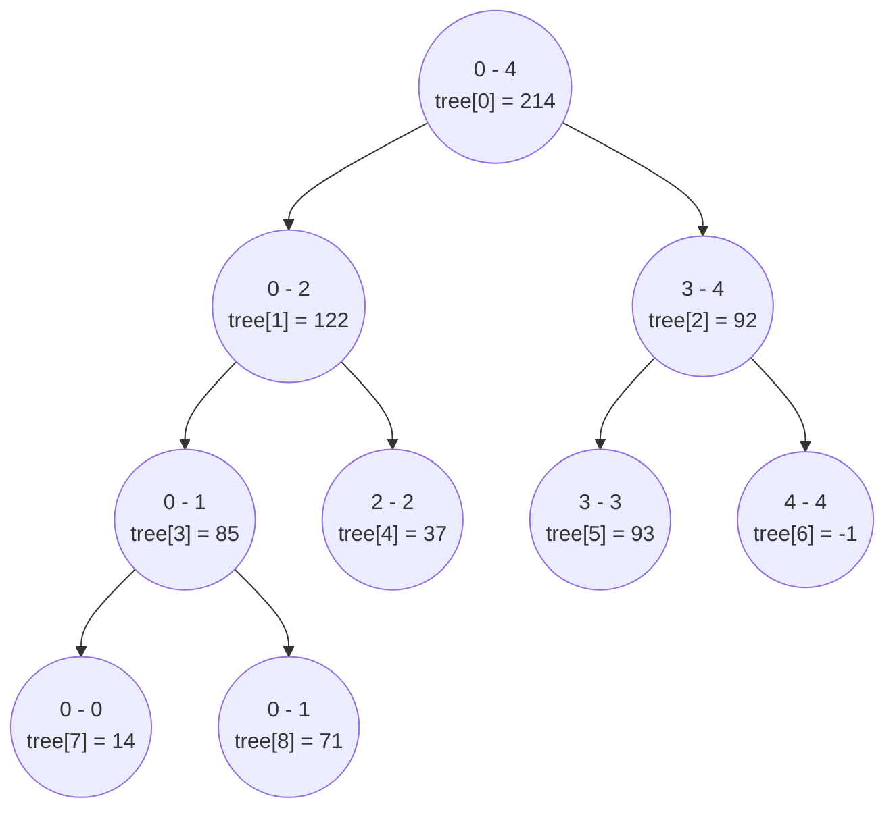

import Tabs from '@theme/Tabs';
import TabItem from '@theme/TabItem';

# Segment Tree

This page provides links to solutions for problems that use the Fenwick Tree data structure.

## Overview

A Segment Tree is a type of data structure that allows for range operations, such as finding the total, minimum, maximum, distinct value within a range, in $\text{O(log N)}$ time complexity.

Additionally, it can perform point updates and range updates in $\text{O(log N)}$ time as well. Despite its name, a segment tree is actually stored as an array of elements.

## Build Segment Tree

We will recursively build the segment tree by splitting the current input segment in half and generating the left and right subtrees. When the current segment consists of a single element, the value of the input segment is assigned to the segment tree array.

Let's build a range sum segment tree for following array. To build a segment tree for an input array with $5$ elements, we considering the initial segment range as $0−4$. 


$$
\text{arr} = \begin{bmatrix}
14, 71, 37, 93, -1
\end{bmatrix}
$$

The resulting segment tree is stored as an array, Here is how segment tree will look like.

<div style={{textAlign:"center"}}>



</div>

<Tabs>
  <TabItem value="Java" label="Java" default>

```java
public int[] buildSegmentTree(int[] arr) {
    // Create a segment tree array
    int[] segmentTree = new int[4 * arr.length];
    build(arr, segmentTree, 0, 0, arr.length - 1);
}

// Recursive method to build the segment tree
private void build(int[] arr, int[] segmentTree, int node, int fromIndex, int toIndex) {
    if (fromIndex == toIndex) {
        // Base case: if the segment consists of a single element
        segmentTree[node] = arr[fromIndex];
    } else {
        int mid = fromIndex + (toIndex - fromIndex) / 2;
        // Recursive calls to build left and right subtrees
        build(arr, segmentTree, 2 * node + 1, fromIndex, mid);
        build(arr, segmentTree, 2 * node + 2, mid + 1, toIndex);
        // Combine values of left and right subtrees
        segmentTree[node] = segmentTree[2 * node + 1] 
          + segmentTree[2 * node + 2];
    }
}
```
</TabItem>
</Tabs>


## Use Segment Tree

There are $3$ main conditions to consider when calculating range sum using segment tree.

- Return $0$ if current segment range falls completely outside the input range.
- Return precomputed sum from segment tree if current segment range falls entirely with the input range. 
- If current segment range partially overlaps with input range recursively calculate values from left and right subtree and return the result.


Let's calculate range sum for range $2$ to $4$. 

1. We will start from the root of the segment tree, which is at index $0$, as the segment tree is stored as an array.

2. The current range $0-4$ partially overlaps with the input range $2-4$, so we will calculate the value from the left and right subtrees recursively.

3. Let's calculate the left subtree first. Now the current range is $0-2$, which again partially overlaps with the input range $2-4$. Let's recursively enter the left subtree again.

4. Entering the left subtree again, we now have the current range as $0-1$, which does not overlap with the input range $2-4$, so the return value is $0$.

5. Backtracking to range $0-2$ and traversing into the right subtree, we find the current range as $2-2$, which entirely falls within the input range $2-4$. Therefore, we return the pre-computed value from node $2-2$, which is $37$.

6. Backtracking to range $0-4$ and traversing into the right subtree, we find current range as $3-4$, which entirely falls within the input range $2-4$. Therefore, we return the pre-computed value from node $3-4$, which is $92$.

There final value for the range sum from $2$ to $4$ is $37 + 92 = 129$.


<Tabs>
  <TabItem value="Java" label="Java" default>

```java
public int rangeSum(int fromIndex, int toIndex) {
    return rangeSumInternal(0, 0, arr.length - 1, fromIndex, toIndex);
}

private int rangeSumInternal(int treeIndex, int segmentStart, int segmentEnd, 
  int fromIndex, int toIndex) {
    // If the segment falls completely outside the input range fromIndex toIndex
    // fromIndex < toIndex < segmentStart < segmentEnd
    // segmentStart < segmentEnd < fromIndex < toIndex
    if (toIndex < segmentStart || segmentEnd < fromIndex) {
        return 0;
    }

    // If the segment falls completely within the range specified by 
    // fromIndex and toIndex
    // fromIndex <= segmentStart <= segmentEnd <= toIndex
    else if (fromIndex <= segmentStart && segmentEnd <= toIndex) {
        return tree[treeIndex];
    }

    // It is partial overlap, calculate value in each subtree
    else {
        int mid = segmentStart + (segmentEnd - segmentStart) / 2;
        int leftValue = rangeSumInternal(2 * treeIndex + 1, segmentStart, 
          mid, fromIndex, toIndex);
        int rightValue = rangeSumInternal(2 * treeIndex + 2, mid + 1, segmentEnd, 
          fromIndex, toIndex);
        return leftValue + rightValue;
    }
}
```
</TabItem>
</Tabs>
