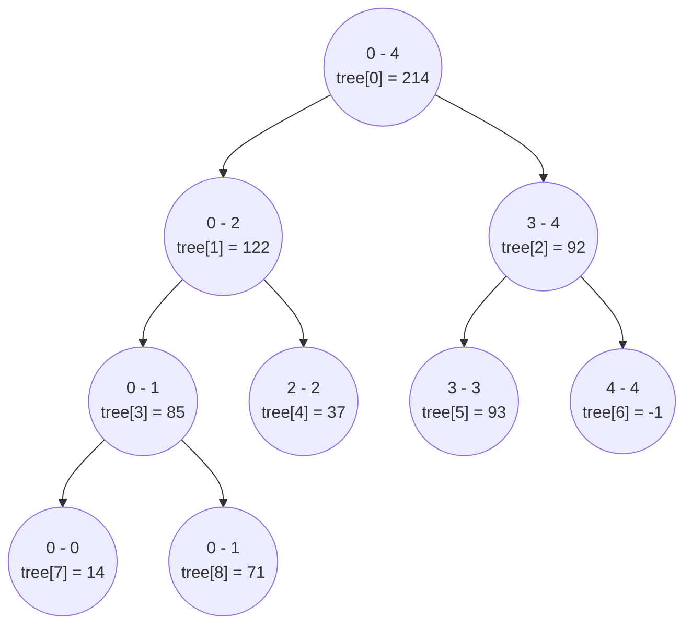

import Tabs from '@theme/Tabs';
import TabItem from '@theme/TabItem';

# Segment Tree

This page provides links to solutions for problems that use the Fenwick Tree data structure.

## Overview

A Segment Tree is a type of data structure that allows for range operations, such as finding the total, minimum, maximum, distinct value within a range, in $\text{O(log N)}$ time complexity.

Additionally, it can perform point updates and range updates in $\text{O(log N)}$ time as well. Despite its name, a segment tree is actually stored as an array of elements.

## Build Segment Tree

We will recursively build the segment tree by splitting the current input segment in half and generating the left and right subtrees. When the current segment consists of a single element, the value of the input segment is assigned to the segment tree array.

Let's build a range sum segment tree for following array. To build a segment tree for an input array with $5$ elements, we considering the initial segment range as $0−4$. 


$$
\text{arr} = \begin{bmatrix}
14, 71, 37, 93, -1
\end{bmatrix}
$$

The resulting segment tree is stored as an array, Here is how segment tree will look like.

<div style={{textAlign:"center"}}>



</div>

<Tabs>
  <TabItem value="Java" label="Java" default>

```java
public void build(int treeIndex, int fromArrIndex, int toArrIndex) {
    if (fromArrIndex == toArrIndex) {
        tree[treeIndex] = arr[fromArrIndex];
    } else {
        int mid = fromArrIndex + (toArrIndex - fromArrIndex) / 2;
        build(2 * treeIndex + 1, fromArrIndex, mid);
        build(2 * treeIndex + 2, mid + 1, toArrIndex);
        tree[treeIndex] = tree[2 * treeIndex + 1] + tree[2 * treeIndex + 2];
    }
}
```
</TabItem>
</Tabs>


## Use Segment Tree

There are $3$ main conditions to consider when calculating range sum using segment tree.

- Return $0$ if current segment range falls completely outside the input range.
- Return precomputed sum from segment tree if current segment range falls entirely with the input range. 
- If current segment range partially overlaps with input range recursively calculate values from left and right subtree and return the result.


<Tabs>
  <TabItem value="Java" label="Java" default>

```java
public int rangeSum(int treeIndex, int from, int to) {
    return rangeSumInternal(treeIndex, from, to, 0, arr.length - 1);
}

public int rangeSumInternal(int treeIndex, int fromArrIndexInput, int toArrIndexInput, 
  int fromArrIndex, int toArrIndex) {
    // Complete overlap
    // fromArrIndexInput <= fromArrIndex <= toArrIndex <= toArrIndexInput
    if (fromArrIndexInput <= fromArrIndex && toArrIndex <= toArrIndexInput) {
        return tree[treeIndex];
    }
    // Out of range
    // fromArrIndex < toArrIndex < fromArrIndexInput < toArrIndexInput 
    // fromArrIndexInput < toArrIndexInput < fromArrIndex < toArrIndex
    else if (toArrIndex < fromArrIndexInput || toArrIndexInput < fromArrIndex) {
        return 0;
    }
    // Partial overlap
    else {
        int mid = fromArrIndex + (toArrayIndex - fromArrIndex) / 2;
        int left = rangeSumInternal(
          2 * treeIndex + 1, 
          fromArrIndexInput, toArrIndexInput, 
          fromArrIndex, mid
        );
        int right = rangeSumInternal(
          2 * treeIndex + 2, 
          fromArrIndexInput, toArrIndexInput, 
          mid + 1, toArrIndex
        );
        return left + right;
    }
}
```
</TabItem>
</Tabs>


## Update Segment Tree

There are two ways to updte Segment Tree

#### Point Update

The function first checks if the given index falls outside the segment range and returns without making any changes if it does. However, if the index falls within the range, the function recursively calls itself on the left or right subtree of the current node, depending on the position of the index relative to the midpoint of the segment range.

This recursive process continues until the index is found. Once the index is found, the function updates the values of that node and backtracks to update its parent nodes accordingly.

<Tabs>
  <TabItem value="Java" label="Java" default>

```java
public void pointUpdate(int arrIndex, int value) {
    return pointUpdateInternal(0, arrIndex, value, 0, arr.length - 1);
}

public void pointUpdateInternal(int treeIndex, int arrIndexInput, int value, 
  int fromArrIndex, int toArrIndex) {
    // Out of range
    if (arrIndexInput < fromArrIndex or toArrIndex < arrIndexInput) {
        return;
    }
    // If an index is found
    else if (fromArrIndex == toArrIndex) {
      tree[treeIndex] = value
    }
    // Partial overlap
    else {
        int mid = fromArrIndex + (toArrIndex - fromArrIndex) / 2;
        if (arrIndexInput > mid) {
          pointUpdateInternal(2 * treeIndex + 2, 
            arrIndexInput, value,
            mid + 1, toArrIndex
          )
        }
        else {
          pointUpdateInternal(2 * treeIndex + 1, 
            arrIndexInput, value
            fromArrIndex, mid
          )
        }
        tree[treeIndex] = tree[2 * treeIndex + 1] + tree[2 * treeIndex + 2]
    }
}
```
</TabItem>
</Tabs>


#### Range Update

Range update follows a similar approach to the point update function, but it handles partial overlap differently. In the case of point updates, a partial overlap implies that the point to be updated is either in the left or the right subtree, and we can traverse that subtree recursively. However, in the case of range updates, the range to be updated may cover both subtrees, so we need to update both sides of the subtree recursively.

<Tabs>
  <TabItem value="Java" label="Java" default>

```java
public void rangeUpdate(int from, int to, int value) {
    return rangeUpdateInternal(0, from, to, value, 0, arr.length - 1);
}

public void rangeUpdateInternal(int treeIndex, int fromArrIndexInput,
  int toArrIndexInput, int value, int fromArrIndex, int toArrIndex) {
    // Out of range
    // fromArrIndexInput < toArrIndexInput < fromArrIndex < toArrIndex
    // fromArrIndex < toArrIndex < fromArrIndexInput < toArrIndexInput
    if (toArrIndexInput < fromArrIndex or toArrIndex < fromArrIndexInput) {
        return;
    }
    // If an index is found
    else if (fromArrIndex == toArrIndex) {
      tree[treeIndex] = value
    }
    // Partial overlap
    else {
        int mid = fromArrIndex + (toArrIndex - fromArrIndex) / 2;
        rangeUpdateInternal(2 * treeIndex + 1, 
          fromArrIndexInput, toArrIndexInput, value, 
          fromArrIndex, mid
        )
        rangeUpdateInternal(2 * treeIndex + 2, 
          fromArrIndexInput, toArrIndexInput, value, 
          mid + 1, toArrIndex
        )
        tree[treeIndex] = tree[2 * treeIndex + 1] + tree[2 * treeIndex + 2]
    }
}
```
</TabItem>
</Tabs>


## Lazy Propagation

A range update in a segment tree can take $\text{O(N)}$ time, where $\text{N}$ is the number of elements in the array. To reduce the update time to $\text{O(log N)}$, you can use a technique called lazy propagation.

#### Range Update with Lazy Propagation

Solution below uses an additional array called $\text{lazy}$ to postpone the updates.

<Tabs>
  <TabItem value="Java" label="Java" default>

```java
public void rangeUpdateLazy(int from, int to, int value) {
    return rangeUpdateLazyInternal(0, from, to, value, 0, arr.length - 1);
}

public void rangeUpdateLazyInternal(int treeIndex, int fromArrIndexInput,
  int toArrIndexInput, int value, int fromArrIndex, int toArrIndex) {
    // Propagate lazy
    if (lazy[treeIndex] != 0) {
      totalLazyValue = lazy[treeIndex] * (toArrIndex - fromArrIndex + 1)
      tree[treeIndex] = tree[treeIndex] * totalLazyValue
      if(fromArrIndex != toArrIndex) {
        lazy[2 * treeIndex + 1] = lazy[2 * treeIndex + 1] + tree[treeIndex]
        lazy[2 * treeIndex + 2] = lazy[2 * treeIndex + 2] + tree[treeIndex]
      }
      lazy[treeIndex] = 0
    }
    // Out of range
    // fromArrIndexInput < toArrIndexInput < fromArrIndex < toArrIndex
    // fromArrIndex < toArrIndex < fromArrIndexInput < toArrIndexInput
    if (toArrIndexInput < fromArrIndex or toArrIndex < fromArrIndexInput) {
        return;
    }

    // Complete overlap
    // fromArrIndex <= fromArrIndexInput <= toArrInputIndex <= toArrIndex
    else if (fromArrIndex <= fromArrIndexInput && toArrInputIndex <= toArrIndex) {
      totalLazyValue = lazy[treeIndex] * (toArrIndex - fromArrIndex + 1)
      tree[treeIndex] = tree[treeIndex] + totalLazyValue
      if(fromArrIndex != toArrIndex) {
        lazy[2 * treeIndex + 1] = lazy[2 * treeIndex + 1] + tree[treeIndex]
        lazy[2 * treeIndex + 2] = lazy[2 * treeIndex + 2] + tree[treeIndex]
      }
      lazy[treeIndex] = 0
    }
    // Partial overlap
    else {
        int mid = fromArrIndex + (toArrIndex - fromArrIndex) / 2;
        rangeUpdateLazyInternal(2 * treeIndex + 1, 
          fromArrIndexInput, toArrIndexInput, value, 
          fromArrIndex, mid
        )
        rangeUpdateLazyInternal(2 * treeIndex + 2, 
          fromArrIndexInput, toArrIndexInput, value, 
          mid + 1, toArrIndex
        )
        tree[treeIndex] = tree[2 * treeIndex + 1] + tree[2 * treeIndex + 2]
    }
}
```
</TabItem>
</Tabs>


#### Range Query with Lazy Propagation

Since we are postponing updates using the $\text{lazy}$ array, we need to apply those delayed updates during a range query.

<Tabs>
  <TabItem value="Java" label="Java" default>

```java
public int rangeSumLazy(int from, int to) {
    return rangeSumLazyInternal(0, from, to, 0, arr.length - 1);
}

public int rangeSumLazyInternal(int treeIndex, int fromArrIndexInput,
  int toArrIndexInput, int fromArrIndex, int toArrIndex) {
    // Propagate lazy
    if (lazy[treeIndex] != 0) {
      totalLazyValue = lazy[treeIndex] * (toArrIndex - fromArrIndex + 1)
      tree[treeIndex] = tree[treeIndex] + totalLazyValue
      if(fromArrIndex != toArrIndex) {
        lazy[2 * treeIndex + 1] = lazy[2 * treeIndex + 1] + lazy[treeIndex]
        lazy[2 * treeIndex + 2] = lazy[2 * treeIndex + 2] + lazy[treeIndex]
      }
      lazy[treeIndex] = 0
    }	
    // Out of range
    // fromArrIndexInput < toArrIndexInput < fromArrIndex < toArrIndex
    // fromArrIndex < toArrIndex < fromArrIndexInput < toArrIndexInput
    if (toArrIndexInput < fromArrIndex or toArrIndex < fromArrIndexInput) {
        return 0;
    }

    // Complete overlap
    // fromArrIndex <= fromArrIndexInput <= toArrInputIndex <= toArrIndex
    else if (fromArrIndex <= fromArrIndexInput && toArrInputIndex <= toArrIndex) {
      return tree[treeIndex]
    }
    // Partial overlap
    else {
        int mid = fromArrIndex + (toArrIndex - fromArrIndex) / 2;
        int left = rangeSumLazyInternal(2 * treeIndex + 1, 
          fromArrIndexInput, toArrIndexInput, 
          fromArrIndex, mid
        )
        int right = rangeSumLazyInternal(2 * treeIndex + 2, 
          fromArrIndexInput, toArrIndexInput, 
          mid + 1, toArrIndex
        )
        return left + right;
    }
}
```
</TabItem>
</Tabs>

## How to Spot These Problems

You can identify segment tree problems if the problem requires you to:
- Quickly calculate the sum of elements from the start of an array up to a certain index.


## Leetcode Problem Set
