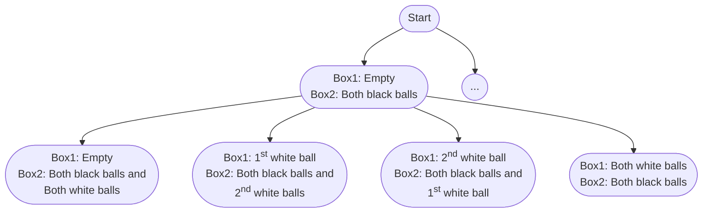

import Tabs from '@theme/Tabs';
import TabItem from '@theme/TabItem';

# 1467. Probability of a Two Boxes...

This page provides solutions for the leetcode problem [1467. Probability of a Two Boxes Having The Same Number of Distinct balls](https://leetcode.com/problems/probability-of-a-two-boxes-having-the-same-number-of-distinct-balls/description/).

## Problem Explanation

The problem requires us to calculate the probability that two boxes will have the same number of distinct balls after shuffling $2\text{N}$ balls into two boxes, such that each box containing $\text{N}$ balls.

For example, let's say Box1 has $4$ balls of $2$ colors, red and black, and Box2 has $4$ balls of $2$ colors, black and blue. It does not matter which specific colors each box contains, but rather how many distinct colors each box contains.


## Solution

For this problem, we need to consider all possible distribution possibilities. Therefore, we use the backtracking technique. [More such problem can be found here](/data-structures-and-algorithms/backtracking).


Let's take the sample input below,

$$
\text{balls} = [2,2]
$$

:::info[Assumption]
Assume $2$ balls at $0^{\text{th}}$ index have black(B) color, whereas $2$ balls at $1^{\text{st}}$ index has white(W) color. 
:::

We start by distributing $2$ black balls into $2$ boxes. 

There are $3$ ways to distribute $2$ indistinguishable black balls among $2$ boxes: 

- Zero black balls to Box$1$ and two black balls to Box$2$.
- One black ball to Box$1$ and one black ball to Box$2$.
- Two black balls to Box$1$ and zero black balls to Box$2$.


Since each black ball is considered distinct, there are actually $4$ ways to distribute them, as there are $2$ ways to choose $1$ black ball from the $2$ black balls. 

The total distribution possibilities for $2$ black balls are as follows:

- Zero black balls to Box$1$ and both black balls to Box$2$.
- First black ball to Box$1$ and second black ball to Box$2$.
- Second black ball to Box$1$ and first black ball to Box$2$.
- Both black balls to Box$1$ and zero black balls to Box$2$.

Similarly, there will be $4$ ways to distribute $2$ distinct white balls into $2$ boxes. 


:::info[]
For simplicity, only the first node (zero black balls to Box$1$ and both black balls to Box$2$) at level $1$ is drawn in graphical representation. The rest of the distributions are represented by dotted node.
:::

Below is a graphical representation of distributing $2$ distinct black balls and $2$ white balls into $2$ boxes: 

<div style={{textAlign:"center"}}>


</div>

While generating all the distribution possibilities, we also determine the number of distributions that have an equal count of balls and an equal number of distinct colors in each box.

There are $6$ such distributions, as shown below:

- Box$1$: Both white balls, Box$2$: Both black balls.
- Box$1$: First black ball and first white ball, Box$2$: Second black ball and second white ball.
- Box$1$: First black ball and second white ball, Box$2$: Second black ball and first white ball.
- Box$1$: Second black ball and first white ball, Box$2$: First black ball and second white ball.
- Box$1$: Second black ball and second white ball, Box$2$: First black ball and first white ball.
- Box$1$: Both black ball, Box$2$: Both white ball.

Once we know the valid distributions, we calculate the total number of distributions using the combinations formula below:

$$
^\text{n}\text{C}_\text{r}= \frac{\text{n}!}{\text{r}!(\text{n}−\text{r})!}
$$

Where $\text{n}$ is the total number of balls, and $\text{r}$ is the number of balls to choose. 

Our problem statement asks us to divide the balls equally between two boxes, so we will choose $\text{n} \div 2$ balls out of a total of $\text{n}$ balls, which gives us $6$ total distributions for our sample input $[2, 2]$.

Finally, we calculate the probability that the two boxes have an equal number of balls and an equal number of distinct colors using the formula below:

$$
\text{Valid distributions} \div \text{Total distributions} = 6 \ \div \  6
$$

Returning our answer as $1$.


## Implementation

<Tabs>
  <TabItem value="Java" label="Java" default>

```java
class Solution {
    double[] factorial = new double[49]; 

    public double getProbability(int[] balls) {
        int sum = 0;
        for (int i = 0; i < balls.length; i++) {
            sum += balls[i];
        }

        factorial[0] = 1;
        for (int i = 1; i < 49; i++) {
            factorial[i] = factorial[i - 1] * i;
        }

        double valid = backtrack(balls, 0, 0, 0, 0, 0); 

        double total = combinations(sum, sum / 2); 

        return valid / total; 
    }

    private double backtrack(int[] balls, int index, int box1Color, int box2Color,
      int box1Count, int box2Count) {

        if (index == balls.length) {
            return box1Count == box2Count && box1Color == box2Color ? 1 : 0;
        } else {
            double res = 0;
            for (int i = 0; i <= balls[index]; i++) {
                double combinations = combinations(balls[index], i);
                res += backtrack(
                  balls, index + 1,
                  i > 0 ? box1Color + 1 : box1Color,
                  i < balls[index] ? box2Color + 1 : box2Color,
                  box1Count + i,
                  box2Count + (balls[index] - i)
                ) * combinations;
            }
            return res;
        }
    }

    private double combinations(int n, int r) {
        return factorial[n] / factorial[n - r] / factorial[r];
    }
}
```
</TabItem>
</Tabs>

## Complexity

Let $\text{N}$ be the length of the input array $\text{balls}$

### Time complexity 

Each of the $\text{N}$ indices in the input array has $2$ boxes to choose from. 

$$
\text{O}(2 ^ \text{N})
$$


:::info[]
Here, we ignore time complexity required to distribute elements at each of the $\text{N}$ indices into $2$ boxes, because the input constraint $1 \leq \text{balls}[\text{i}] \leq 6$ ensures that this number will be very small.
:::

### Space complexity

Since there are $\text{N}$ indices to assign to each box, the stack size for the backtracking will be $\text{N}$.

$$
\text{O}(\text{N})
$$

