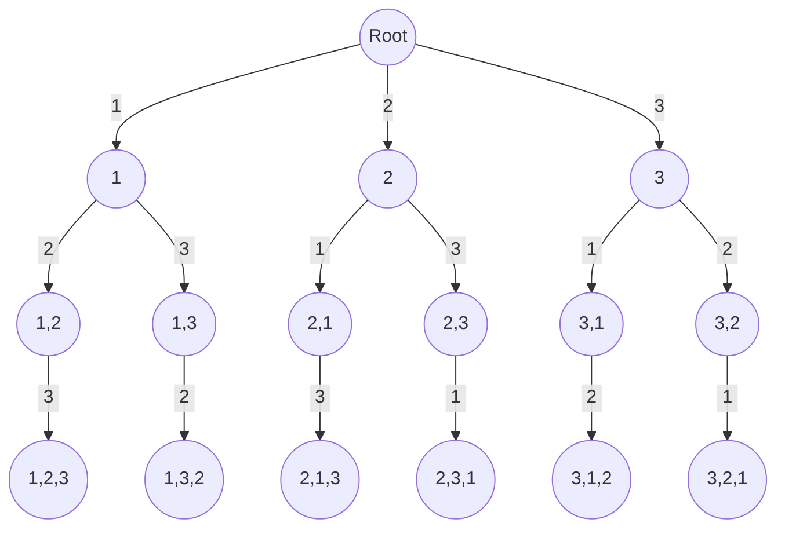

import Tabs from '@theme/Tabs';
import TabItem from '@theme/TabItem';

# 1879. Minimum XOR Sum of Tw...

This page provides solutions for the leetcode problem [1879. Minimum XOR Sum of Two Arrays](https://leetcode.com/problems/minimum-xor-sum-of-two-arrays).

## Problem Explaination 

The problem is asking us to minimize the XOR of two input array $\text{nums}1$ and $\text{nums}2$, given that you can rearrange elements of $\text{nums2}$.

## Solution

This problem can be solved using the Permutations technique. [More such questions can be found here](/data-structures-and-algorithms/permutations).

To solve this problem using the permutation technique, create all permutations of the array $\text{nums2}$ and calculate the XOR of each permuted array with the array $\text{nums1}$. 

This approach will require a time complexity of $\text{N}!$, where $\text{N}$ is the total number of elements in the array $\text{nums2}$.

Let's take the sample input as below,

$$
\text{nums}1 = \begin{bmatrix}1, 0, 3\end{bmatrix}, \text{nums}2 = \begin{bmatrix}1, 2, 3\end{bmatrix}
$$

Below is a graphical representation of creating permutations for the input array $\text{nums2}$:


<div style={{textAlign:"center"}}>



</div>


## Implementation

<Tabs>
  <TabItem value="Java" label="Java" default>

```java
import java.util.HashMap;

class Solution {
    private HashMap<Integer, Integer> memo;

    public int minimumXORSum(int[] nums1, int[] nums2) {
        memo = new HashMap<>();
        int res = permute(nums1, nums2, 0, 0);
        return res;
    }

    private int permute(int[] nums1, int[] nums2, int index, int mask) {
        if (memo.containsKey(mask)) {
            return memo.get(mask);
        }

        if (index == nums2.length) {
            return 0;
        } else {
            int ans = Integer.MAX_VALUE;
            for (int i = 0; i < nums2.length; i++) {
                // Skip if the bit at position i in the mask is already set
                if (((mask >> i) & 1) == 1) {
                    continue;
                }

                // Calculate internal answer using XOR and recursion
                int internalAns = (nums1[index] ^ nums2[i]) + permute(
                        nums1,
                        nums2,
                        index + 1,
                        mask | (1 << i)
                );
                ans = Math.min(ans, internalAns);
            }
            memo.put(mask, ans);
            return ans;
        }
    }
}
```
</TabItem>
</Tabs>

:::info[]

In this solution we have avoided redundant computations by adding memoization. 

Consider if we've chosen the $0$<sup>th</sup> and $1$<sup>st</sup> elements from input array ${\text{num2}}$, and then again 

:::


## Complexity 

Let's say there are $\text{N}$ elements in an array, and we need to create $\text{K}$ subsets.

### Time complexity 

The time complexity is $\text{O}(2^{\text{N}})$ for creating a single subset, as we can either choose or skip each element of an array, and $\text{O}(\text{K})$ for creating $\text{K}$ subsets.

Total time complexity will be, 

$$
\text{O}(\text{K} * 2^{\text{N}})
$$


### Space complexity

At any given time, the excution stack will have at most $\text{N}$ elements.

$$
\text{O}(\text{N})
$$

