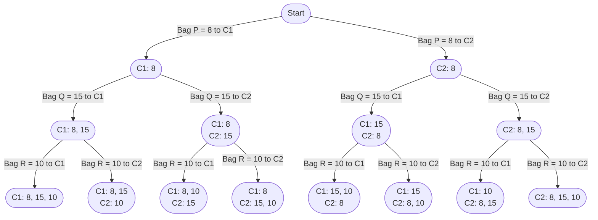

import Tabs from '@theme/Tabs';
import TabItem from '@theme/TabItem';

# 2305. Fair Distribution of Cookies

This page provides solutions for the leetcode problem [2305. Fair Distribution of Cookies](https://leetcode.com/problems/fair-distribution-of-cookies/description/).

## Problem Explanation 

The problem is asking us to divide the cookies among $\text{K}$ children in such a way that the maximum number of cookies a single child gets is minimized.

## Solution

For this problem, we need to consider all possible distribution possibilities. Therefore, we use the backtracking technique. [More such problem can be found here](/data-structures-and-algorithms/backtracking).


Let's take the sample input below,

$$
\text{cookies} = [8,15,10], \ \text{k} = 2
$$

:::info[Assumption]
Assume bag which has $8$ cookies is called $\text{P}$, bag which has $15$ cookies is called $\text{Q}$ and bag which has $10$ cookies is called $\text{R}$.
:::

We start by assigning $\text{P}$ bag among $2$ children, which gives us $2$ possibilities. Next we assign $\text{Q}$ and $\text{R}$ bags in the next iterations, which gives us total of $8$ possibilities.

Below is a graphical representation of the distribution of $3$ cookie bags $\text{P}, \text{Q}, \text{R}$ among $2$ childrens: 

<div style={{textAlign:"center"}}>


</div>

We calculate maximum number of cookies a single child gets for each distribution. 

- For the distribution $\text{W}1: [3, 2, 4]$ and $\text{W}2: [\ ]$, the maximum working time is $9$ for the worker $\text{W}1$.
- For the distribution $\text{W}1: [3, 2]$ and $\text{W}2: [4]$, the maximum working time is $5$ for the worker $\text{W}1$.
- For the distribution $\text{W}1: [3, 4]$ and $\text{W}2: [2]$, the maximum working time is $7$ for the worker $\text{W}1$.
- For the distribution $\text{W}1: [3]$ and $\text{W}2: [2, 4]$, the maximum working time is $6$ for the worker $\text{W}2$.
- For the distribution $\text{W}1: [2, 4]$ and $\text{W}2: [3]$, the maximum working time is $6$ for the worker $\text{W}1$.
- For the distribution $\text{W}1: [2]$ and $\text{W}2: [3, 4]$, the maximum working time is $7$ for the worker $\text{W}2$.
- For the distribution $\text{W}1: [4]$ and $\text{W}2: [3, 2]$, the maximum working time is $5$ for the worker $\text{W}2$.
- For the distribution $\text{W}1: [\ ]$ and $\text{W}2: [3, 2, 4]$, the maximum working time is $9$ for the worker $\text{W}2$.

Among all the distributions, the minimum value of the maximum working time is $5$, so we return $5$ as the answer.


## Implementation
<Tabs>
  <TabItem value="Java" label="Java" default>

```java
class Solution {
    private int min = Integer.MAX_VALUE;

    public int distributeCookies(int[] cookies, int k) {
        backtrack(cookies, 0, new int[k]);
        return min;
    }

    private void backtrack(int[] cookies, int index, int[] dist) {
        if (index == cookies.length) {
            min = Math.min(min, max(dist));
        } else {
            for (int i = 0; i < dist.length; i++) {
                if (dist[i] + cookies[index] >= min) continue;

                dist[i] += cookies[index]; 
                backtrack(cookies, index + 1, dist);
                dist[i] -= cookies[index];
            }
        }
    }

    private int max(int[] dist) {
        int maxValue = Integer.MIN_VALUE;
        for (int i = 0; i < dist.length; i++) {
            maxValue = Math.max(maxValue, dist[i]);
        }
        return maxValue;
    }
}
```
</TabItem>
</Tabs>


## Complexity

Let's say there are $\text{N}$ bags of cookies to distribute among $\text{K}$ children.

### Time complexity 

Each of the $\text{N}$ bag has $\text{K}$ options to choose from.

$$
\text{O}(\text{K} ^ \text{N})
$$


### Space complexity

Since there are $\text{N}$ bags to assign to each child, the stack size for the backtracking will go upto $\text{N}$. Additionally, an array of size $\text{K}$ is needed to hold the distribution of bags among the $\text{K}$ children.

$$
O(\text{N} + \text{K})
$$

