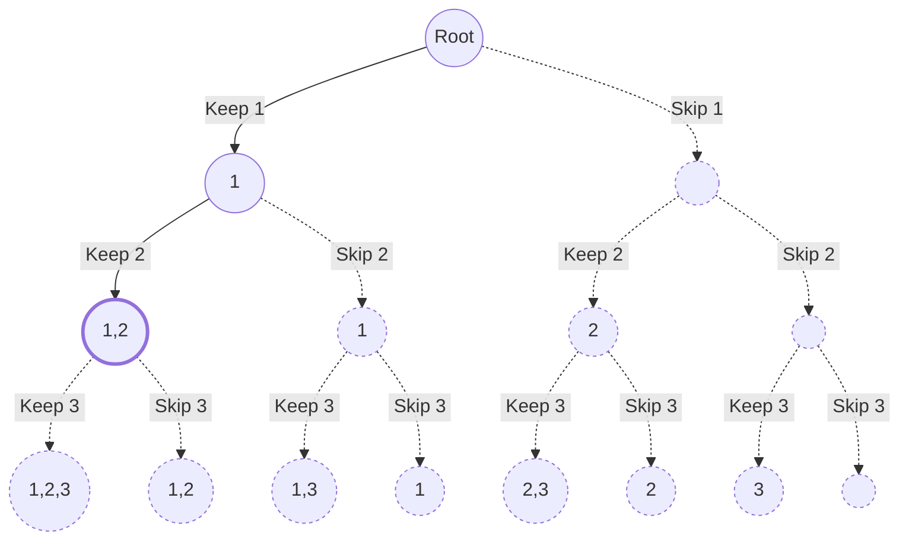

import Tabs from '@theme/Tabs';
import TabItem from '@theme/TabItem';

# 698. Partition to K Equal Sum Su...

This page provides solutions for the leetcode problem [698. Partition to K Equal Sum Subsets](https://leetcode.com/problems/partition-to-k-equal-sum-subsets).

## Problem Explaination 

The problem is asking us to check if it is possible to partition an array into $\text{K}$ subarray such that each partition has an equal sum. 


## Solution

This problem can be solved using backtracking, but since input size is large, we will be use combinations. [More such questions can be found here](/data-structures-and-algorithms/combinations).

To solve this problem using backtracking, think of it like the $\text{N}$-Queen problem, where you try to assign each element of an array to one of the $\text{K}$ subsets. 

Backtracking approach will require a time complexity of $\text{K}^\text{N}$, as there are $\text{K}$ options for each of the $\text{N}$ elements in the array. For smaller values of $\text{K}$, backtracking works best. However, when $\text{K}$ grows larger, time complexity of $\text{K}^\text{\text{N}}$ will result in a time limit exceeded exception.

A better approach is to use the combination method. In this approach, we first create a single subset, which takes a time complexity of $\text{2}^\text{N}$. Therefore, creating $\text{K}$ subsets will take $\text{K} * \text{2}^\text{N}$.

Let's take the sample input as below,

$$
\text{nums} = \begin{bmatrix}
1,2,3
\end{bmatrix}, \ 
\text{K} = 2
$$

We will start by verifying if sum of the array elements can be divided into $\text{K}$ equal sum parts using the formula:

$$
\text{Sum of array elements} \ \% \ \text{K}  = \ 0
$$

If the sum of array elements is not divisible by $\text{K}$, it is impossible to partition the array into $\text{K}$ subsets with equal sums. Since condition holds true for sample input, let's calculate required equal sum using formula below: 

$$
\text{Sum of array elements} \ \div \ \text{K}
$$

Required equal sum will be calculated as $3$.

Next, we will create a single subset using the choose or skip approach, such that sum of all the elements in the subset equals required sum $3$. We will repeat this process until $\text{K} = 2$ subsets are formed.

Below is a graphical representation of creating subsets using the combination choose or skip approach:

<div style={{textAlign:"center"}}>



</div>

For our sample input $\text{nums} = \begin{bmatrix}1,2,3\end{bmatrix}$, when our algorithm reaches a node with the subset $[1, 2]$, it finds that subset sum is $3$, which matches the required sum. Thus creating a first subset.

We also mark the elements used in creation of first subset as visited using bitmap masking, ensuring that these elements are not reused when creating remaining $\text{K} - 1$ subsets.

For the next iteration of subset creation, only one element, remains, which forms another subset $[3]$.

Since we have created $\text{K} = 2$ subsets, $[1,2]$ and $[3]$, each with the required equal sum of $3$, we return true.

## Implementation

<Tabs>
  <TabItem value="Java" label="Java" default>

```java
import java.util.HashMap;

class Solution {

    private HashMap<Integer, Boolean> memo;

    public boolean canPartitionKSubsets(int[] nums, int k) {
        // Memoization
        memo = new HashMap<>();

        // Calculate sum of all elements of an array
        int totalArraySum = 0;
        for (int num : nums) {
            totalArraySum += num;
        }

        // Check if an array can be partitioned into k subsets
        if (totalArraySum % k != 0) {
            return false;
        }

        return combination(nums, 0, 0, 0, totalArraySum / k, k);
    }

    private boolean combination(int[] nums, int mask, int index, int sum, 
      int requiredSum, int k) {

        if (memo.containsKey(mask)) return memo.get(mask);

        // K subsets are ready
        if (k == 0) {
            return true;
        } 
        // Current subset sum is greater than required sum
        else if (sum > requiredSum) {
          return false;
        } 
        // Current subset sum is equal to required sum
        else if (sum == requiredSum) {
            // Check if we can create next k - 1 subsets  
            boolean ans = combination(nums, mask, 0, 0, requiredSum, k - 1);
            memo.put(mask, ans);
            return ans;
        }

        if (index == nums.length) return false;

        // Check if current element is visited
        if (((mask >> index) & 1) == 0) {
            // Mark current element as visited 
            mask = (mask | (1 << index));

            // Choose current element 
            if (combination(nums, mask, index + 1, sum + nums[index], 
              requiredSum, k)) {
                memo.put(mask, true);
                return true;
            }

            // Unmark current element as visited
            mask = (mask ^ (1 << index)); 
        }

        // Skip current element 
        if (combination(nums, mask, index + 1, sum, requiredSum, k)) {
            memo.put(mask, true);
            return true;
        }

        memo.put(mask, false);
        return false;
    }
}
```
</TabItem>
</Tabs>

:::info[]

In this solution we have avoided redundant computations by adding memoization. 

Consider if we've chosen the $0$<sup>th</sup> and $1$<sup>st</sup> elements in set $1$ and the $2$<sup>nd</sup> and $3$<sup>rd</sup> elements in set $2$, but then found 
we can't make set $3$ with the remaining items, we remember this situation.

If in different recursive calls, we selected the $0$<sup>th</sup> and $3$<sup>rd</sup> elements in set $1$, and the $1$<sup>st</sup> and $2$<sup>nd</sup> elements in set $2$, rather than rechecking if we can create set $3$, we retrieve the previously stored answer (false) from memory.

:::

## Complexity 

Let's say there are $\text{N}$ elements in an array, and we need to create $\text{K}$ subsets.

### Time complexity 

The time complexity is $\text{O}(2^{\text{N}})$ for creating a single subset, as we can either choose or skip each element of an array, and $\text{O}(\text{K})$ for creating $\text{K}$ subsets.

Total time complexity will be, 

$$
\text{O}(\text{K} * 2^{\text{N}})
$$


### Space complexity

At any given time, the excution stack will have at most $\text{N}$ elements.

$$
\text{O}(\text{N})
$$

