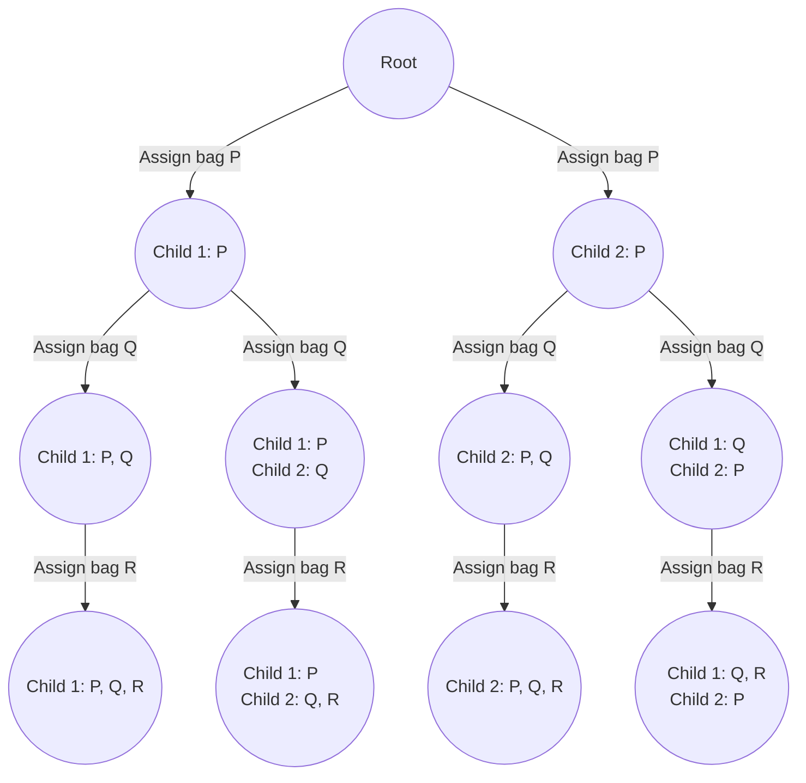

import Tabs from '@theme/Tabs';
import TabItem from '@theme/TabItem';


# Partition Array Into K Subarrays


This page offers detailed explanations and Java solutions for problems that involve partitioning an array into $K$ subarrays, using the Backtracking technique.


## Fair Distribution of Cookies

The problem description can be found at [2305. Fair Distribution of Cookies](https://leetcode.com/problems/fair-distribution-of-cookies/description/).


### Explanation 
Some problems simply call for a basic backtracking method to solve them. You can spot these by considering \
the size of the input. Another clue is that the problem requires checking all possible outcomes before arriving \
at the expected solution.


Let's take the sample input as below,

<br />
$$
\text{cookies} = \begin{bmatrix}
6, 1, 3, 2, 2, 4, 1, 2
\end{bmatrix}, 
\  \text{k} = 3
$$
<br />


:::info
Because the task involves distributing the array rather than splitting it, the binary search algorithm isn't \
suitable for this problem.
:::

<br />

Backtracking involves solving problems by progressively constructing potential solutions, so let's start by \
assigning the first bag of cookies to each child one by one, then proceed to the second, third, and so forth.


Let's visualize the distribution of cookie bags $P$, $Q$, and $R$ among $2$ children.

<br />
<div style={{textAlign:"center"}}>


</div>
<br />


### Implementation
<Tabs>
  <TabItem value="Java" label="Java" default>

```java
class Solution {
    public int distributeCookies(int[] cookies, int k) {
        return backtrack(cookies, 0, new int[k]);
    }

    // Backtracking method to find the minimum of maximum value
    private int backtrack(int[] cookies, int index, int[] dist) {
        // Base case: all cookies are distributed
        if (index == cookies.length) {
            return max(dist);
        }
        int minValue = Integer.MAX_VALUE;
        // Try distributing current cookie to each child and find the minimum value
        for (int i = 0; i < dist.length; i++) {
            dist[i] += cookies[index]; // Distribute cookie to child i
            minValue = Math.min(minValue, backtrack(cookies, index + 1, dist));
            dist[i] -= cookies[index]; // Backtrack: remove the distributed cookie
        }
        return minValue;
    }

    // Method to find the maximum value in a distribution
    private int max(int[] dist) {
        int maxValue = Integer.MIN_VALUE;
        // Find the maximum value in the distribution
        for (int i = 0; i < dist.length; i++) {
            maxValue = Math.max(maxValue, dist[i]);
        }
        return maxValue;
    }
}
```
</TabItem>
</Tabs>


### Complexity 

Let's say there are $N$ bags of cookies to distribute among $K$ children.

#### Time complexity 
$
O(K ^ N)
$

#### Space complexity
$
O(K + N)
$


<br />

## Similar questions

Here are some more questions that can be solved using the same technique.


### Probability of a Two Boxes Having The Same Number of Distinct Balls

The problem description can be found at [1467. Probability of a Two Boxes Having The Same Number of Distinct Balls](https://leetcode.com/problems/probability-of-a-two-boxes-having-the-same-number-of-distinct-balls/description/).


<details>
  <summary>Solution</summary>

<Tabs>
  <TabItem value="Java" label="Java" default>

```java
class Solution {
    double[] factorial = new double[49]; // Array to store factorials

    // Main method to calculate probability
    public double getProbability(int[] balls) {
        int sum = 0;
        // Calculate total number of balls
        for (int i = 0; i < balls.length; i++) {
            sum += balls[i];
        }

        // Calculate factorials for later use
        factorial[0] = 1;
        for (int i = 1; i < 49; i++) {
            factorial[i] = factorial[i - 1] * i;
        }

        double valid = backtrack(balls, 0, 0, 0, 0, 0); // Calculate valid cases
        double total = combinations(sum, sum / 2); // Calculate total combinations

        return valid / total; // Return probability
    }

    // Backtracking method to calculate valid cases
    private double backtrack(int[] balls, int index, int box1Color, int box2Color,
                             int box1Count, int box2Count) {
        if (index == balls.length) {
            // Check if counts and colors match for both boxes
            return box1Count == box2Count && box1Color == box2Color ? 1 : 0;
        } else {
            double res = 0;
            for (int i = 0; i <= balls[index]; i++) {
                double combinations = combinations(balls[index], i);
                res += combinations * backtrack(
                        balls, index + 1,
                        i > 0 ? box1Color + 1 : box1Color,
                        i < balls[index] ? box2Color + 1 : box2Color,
                        box1Count + i,
                        box2Count + (balls[index] - i)
                );
            }
            return res;
        }
    }

    // Method to calculate combinations using factorials
    private double combinations(int n, int r) {
        return factorial[n] / factorial[n - r] / factorial[r];
    }
}
```
</TabItem>
</Tabs>
</details>


