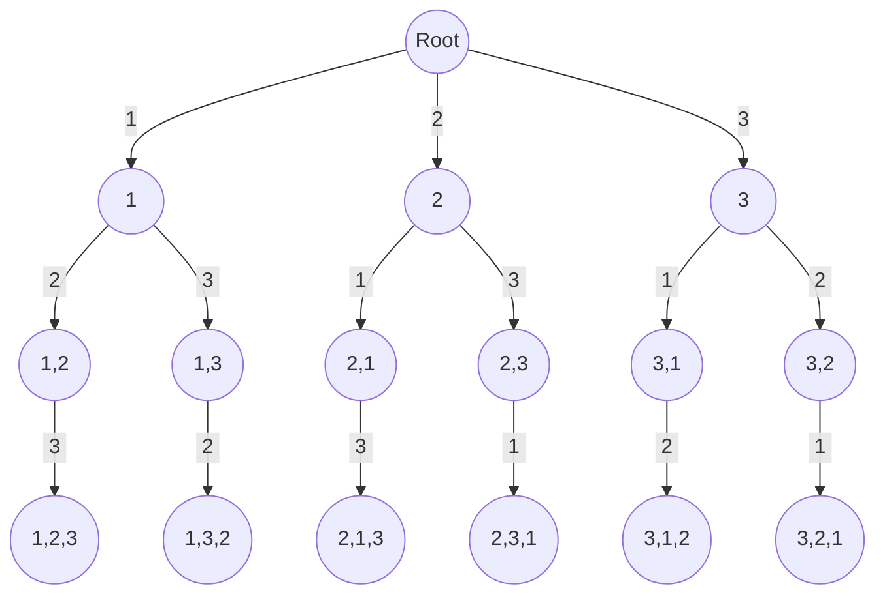
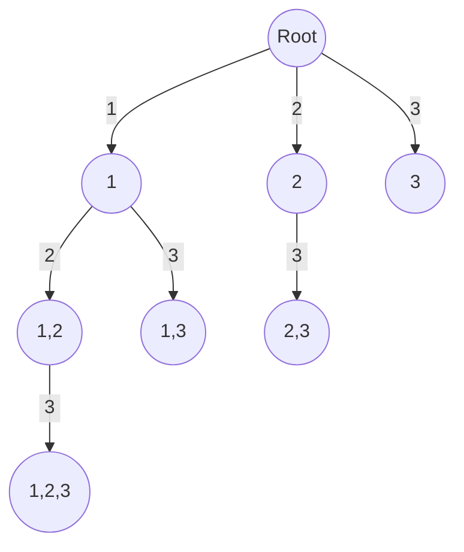

import Tabs from '@theme/Tabs';
import TabItem from '@theme/TabItem';


#  Partition to K Equal Subset Sum

This page explains Java solution to leetcode problem [698. Partition to K Equal Sum Subsets](https://leetcode.com/problems/partition-to-k-equal-sum-subsets/description/) using combination approach


## Explanation 

Let's take the sample input as below,


$$
\text{nums} = \begin{bmatrix}
1,2,3
\end{bmatrix}, \ 
\text{k} = 2
$$
<br />

Initially, we'll verify if the total array sum can be evenly divided into $k$ parts by confirming that 
$$
\text{totalArraySum} \  \% \ k  = \ 0.
$$


## Permutation approach

Let's say we have $N$ elements in an array.

The Idea is for each recursive call, we will iterate over $N$ elements and make another recursive call. Assume \
we picked one element, then we iterate over the array and make recursive calls to remaining $N−1$ \
elements and so on.

Therefore, in the worst-case scenario, the total number of recursive calls will be

$$
N \ ⋅ \ (N−1) \ ⋅ \ (N−2) \ ⋅ \ ... \ ⋅ \ 2 \ ⋅ \ 1 \ = \ N!
$$

<br />


Permutation tree will look like below.

<br />
<div style={{textAlign:"center"}}>



</div>
<br />


### Implementation
<Tabs>
  <TabItem value="Java" label="Java" default>

```java
class Solution {
     // Function to check if the given array can be partitioned into k subsets 
     // with equal sums
    public boolean canPartitionKSubsets(int[] nums, int k) {
        // Calculate the total sum of the array elements
        int totalArraySum = 0;
        for (int num : nums) {
            totalArraySum += num;
        }
 
       // If the total sum is not divisible by k, return false as equal 
       // partitioning isn't possible 
        if (totalArraySum % k != 0) {
            return false;
        }

        // Check if the array can be partitioned into k subsets with equal sums
        return permute(nums, 0, totalArraySum / k, k, new boolean[nums.length]);
    }

    // Recursive function to find if partitioning is possible
    private boolean permute(int[] nums, int sum, int requiredSum, int k, 
      boolean[] visited) {
        // If all k subsets are formed, return true
        if (k == 0) {
            return true;
        } else if (sum > requiredSum) {
            // If the current sum exceeds the required sum, return false
            return false;
        } else if (sum == requiredSum) {
            // If the current sum matches the required sum, move to the next subset
            return permute(nums, 0, requiredSum, k - 1, visited);
        }

        // Iterate through array elements
        for (int i = 0; i < nums.length; i++) {
            if (visited[i]) continue;
            // Mark element as visited
            visited[i] = true;
            // Recursively check next elements to form the subsets
            if (permute(nums, sum + nums[i], requiredSum, k, visited)) {
                return true;
            }
            // Backtrack if subset with current element doesn't lead to a solution
            visited[i] = false;
        }
        return false;
    }
}
```
</TabItem>
</Tabs>

<br />
:::info[]
Notice how we start the for loop from $0$ every time and continue with the recursive call only if the element hasn't been visited yet.
:::
<br />


### Complexity 

Let's say there are $N$ elements in an array.

#### Time complexity 
$
O(N . \ N!)
$

:::warning[]
The complexity of $N!$ makes the permutation approach viable only for smaller inputs.
:::

#### Space complexity
$
O(N)
$
<br />


## Combination Approach
In this problem, the order of items in a subset doesn't make a difference. So, we can use a combination method \
to solve it.


Combination tree will look like below.

<br />
<div style={{textAlign:"center"}}>



</div>
<br />


### Implementation
<Tabs>
  <TabItem value="Java" label="Java" default>

```java
class Solution {
     // Function to check if the given array can be partitioned into k subsets 
     // with equal sums
     public boolean canPartitionKSubsets(int[] nums, int k) {
        // Calculate the total sum of the array elements
        int totalArraySum = 0;
        for (int num : nums) {
            totalArraySum += num;
        }

        // If the total sum is not divisible by k, 
        // return false as equal partitioning isn't possible
        if (totalArraySum % k != 0) {
            return false;
        }

        // Check if the array can be partitioned into k subsets with equal sums
        return combination(nums, 0, 0, totalArraySum / k, 
          k, new boolean[nums.length]);
    }

    // Recursive function to find if partitioning is possible
    private boolean combination(int[] nums, int index, int sum, int requiredSum, 
		   int k, boolean[] visited) {
        // If all k subsets are formed, return true
        if (k == 0) {
            return true;
        } else if (sum > requiredSum) {
            // If the current sum exceeds the required sum, return false
            return false;
        } else if (sum == requiredSum) {
            // If the current sum matches the required sum, move to the next subset
            return combination(nums, 0, 0, requiredSum, k - 1, visited);
        }

        // Iterate through array elements
        for (int i = index; i < nums.length; i++) {
            if (visited[i]) {
                continue;
            }
            // Mark element as visited
            visited[i] = true;
            // Recursively check next elements to form the subsets
            if (combination(nums, i + 1, sum + nums[i], requiredSum, k, visited)) {
                return true;
            }
            // Backtrack if subset with current element doesn't lead to a solution
            visited[i] = false;
        }
        return false;
    }
}
```
</TabItem>
</Tabs>

<br />
:::info[]
In Combination approach we begin the for loop from a $\text{index}$ each time and don't reset it to $0$
:::
<br />


### Complexity 

Let's say there are $N$ elements in an array and we are required to generate $k$ subsets.

#### Time complexity 
$
O(k \ . 2^{N})
$

:::warning[]
The complexity of $O(k \ . 2^{N})$ is slightly better than the complexity of the permutation approach. However, \
it remains suitable for smaller inputs due to its exponential nature.
:::


#### Space complexity
$
O(N)
$
<br />


## Memoization and Bitmasking.

We can avoid redundant computations by adding memoization. 

Consider if we've chosen the 0<sup>th</sup> and 1<sup>st</sup> elements in set 1 and the 2<sup>nd</sup> and 3<sup>rd</sup> elements in set 2, but then found 
we can't make set 3 with the remaining items, we remember this situation."

If in different recursive calls, we selected the 0<sup>th</sup> and 3<sup>rd</sup> elements in set 1, and the 1<sup>st</sup> and 2<sup>nd</sup> elements in \
set 2, rather than rechecking if we can create set 3, we retrieve the previously stored answer (false) from memory.


Also, since the number of elements in this problem is limited to 16, we can efficiently use Bitmasking.


### Implementation

<Tabs>
  <TabItem value="Java" label="Java" default>

```java
class Solution {

    private HashMap<Integer, Boolean> memo;

    // Function to check if the given array can be partitioned 
    // into k subsets with equal sums
    public boolean canPartitionKSubsets(int[] nums, int k) {
        memo = new HashMap<>();

        // Calculate the total sum of the array elements
        int totalArraySum = 0;
        for (int num : nums) {
            totalArraySum += num;
        }

        // If the total sum is not divisible by k, return false as 
        // equal partitioning isn't possible
        if (totalArraySum % k != 0) {
            return false;
        }

        // Check if the array can be partitioned into k subsets with equal sums
        return combination(nums, 0, 0, 0, totalArraySum / k, k);
    }

    // Recursive function to find if partitioning is possible
    private boolean combination(int[] nums, int mask, int index, int sum, 
      int requiredSum, int k) {
        
        if(memo.containsKey(mask)) return memo.get(mask);

        // If all k subsets are formed, return true
        if (k == 0) {
            return true;
        } else if (sum > requiredSum) {
            // If the current sum exceeds the required sum, return false
            return false;
        } else if (sum == requiredSum) {
            // If the current sum matches the required sum, move to the next subset
            boolean ans = combination(nums, mask, 0, 0, requiredSum, k - 1);
            memo.put(mask, ans);
            return ans;
        }

        // Iterate through array elements
        for (int i = index; i < nums.length; i++) {
            // Check if index is already visited 
            if(((mask >> i) & 1) != 0) continue;

            // Mark element as visited
            mask = (mask | (1 << i));

            // Recursively check next elements to form the subsets
            if (combination(nums, mask, i + 1, sum + nums[i], requiredSum, k)) {
                memo.put(mask, true);
                return true;
            }

            // Backtrack if subset with current element doesn't lead to a solution
            mask = (mask ^ (1 << i));
        }
        memo.put(mask, false);
        return false;
    }
}
```
</TabItem>
</Tabs>


### Complexity 

Let's say there are $N$ elements in an array.

#### Time complexity 
$
O(N \ . \ 2^{N})
$


#### Space complexity
$
O(2^{N})
$
<br />


