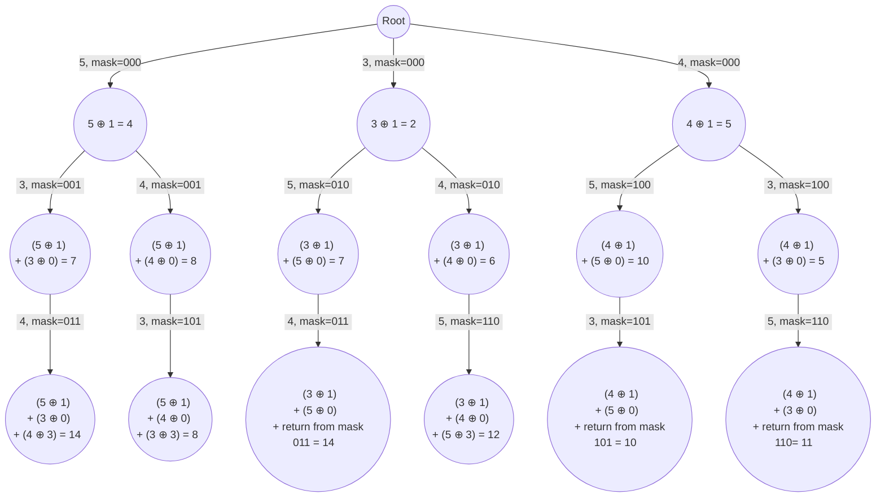

import Tabs from '@theme/Tabs';
import TabItem from '@theme/TabItem';


# Arrangement of Array Elements

This page offers detailed explanations and Java solutions for problems which involve arranging elements of an array the Permutation technique.


## Minimum XOR Sum of Two Arrays

The problem description can be found at [Leetcode 1879. Minimum XOR Sum of Two Arrays](https://leetcode.com/problems/minimum-xor-sum-of-two-arrays/description/)


### Explanation 

The problem is all about re-arranging elements in num2 to minimize the XOR sum. To tackle this, we start by generating all possible permutations of nums2 and calculate the XOR sum along the way.


Let's take the sample input below,

<br />
$$
\text{nums1} = \begin{bmatrix}
1,0,3
\end{bmatrix}, 
\ \text{nums2} = \begin{bmatrix}
5,3,4
\end{bmatrix}
$$
<br />


Code execution tree will look like below,

<br />
<div style={{textAlign:"center"}}>



</div>

<br />


### Implementation
<Tabs>
  <TabItem value="Java" label="Java" default>

```java

import java.util.HashMap;

class Solution {
    private HashMap<Integer, Integer> memo;

    public int minimumXORSum(int[] nums1, int[] nums2) {
        memo = new HashMap<>();
        return permute(nums1, nums2, 0, 0);
    }

    // Permute method to find the minimum XOR sum
    private int permute(int[] nums1, int[] nums2, int index, int mask) {
        // Check if the mask is memoized
        if (memo.containsKey(mask)) {
            return memo.get(mask);
        }

        // Base case: all elements of nums2 are used
        if (index == nums2.length) {
            return 0;
        } else {
            int ans = Integer.MAX_VALUE;
            for (int i = 0; i < nums2.length; i++) {
                // Skip if the bit at position i in the mask is already set
                if (((mask >> i) & 1) == 1) {
                    continue;
                }

                // Calculate internal answer using XOR and recursion
                int internalAns = (nums1[index] ^ nums2[i]) + permute(
                        nums1,
                        nums2,
                        index + 1,
                        mask | (1 << i)
                );
                ans = Math.min(ans, internalAns);
            }
            memo.put(mask, ans);
            return ans;
        }
    }
}
```
</TabItem>
</Tabs>


### Complexity 

Let's say there are $N$ elements in an array

#### Time complexity 
$
O(N!)
$

#### Space complexity
$
O(N)
$


<br />

## Similar questions

Here are some more questions that can be solved using the same technique.

### Minimum Number of Work Sessions to Finish the Tasks

The problem description can be found at [1986. Minimum Number of Work Sessions to Finish the Tasks](https://leetcode.com/problems/minimum-number-of-work-sessions-to-finish-the-tasks/description/).


<details>
  <summary>Solution</summary>

<Tabs>
  <TabItem value="Java" label="Java" default>

```java
import java.util.HashMap;

class Solution {
    private HashMap<String, Integer> memo;

    public int minSessions(int[] tasks, int sessionTime) {
        memo = new HashMap<>();
        return permute(tasks, 0, sessionTime, 0);
    }

    // Function to calculate the minimum sessions needed
    private int permute(int[] tasks, int currentSession, int sessionTime, 
      int mask) {
        String key = currentSession + " " + mask;

        // If all tasks are completed, return 1 session
        if (mask == (1 << tasks.length) - 1) {
            return 1;
        } else if (memo.containsKey(key)) { 
            // If memoization contains the calculated result, return the value
            return memo.get(key);
        } else {
            int res = Integer.MAX_VALUE;

            // Iterate through each task to find the minimum sessions required
            for (int i = 0; i < tasks.length; i++) {
                if (((mask >> i) & 1) == 1) {
                    continue; // Skip if task is completed
                }

                // If the current session time plus the task 
                // time exceeds the session time limit
                if (currentSession + tasks[i] > sessionTime) {
                    res = Math.min(
                            res,
                            1 + permute(
                              	  tasks,
                                  // Start a new session with the current task
                                  tasks[i], 
                                  sessionTime,
                                  mask | (1 << i)
                            )
                    );
                } else {
                    // Continue the current session with the current task
                    res = Math.min(
                            res,
                            permute(tasks,
                              currentSession + tasks[i],
                              sessionTime,
                              mask | (1 << i)
                            )
                    );
                }
            }

            // Store the calculated result in memoization
            memo.put(key, res);
            return res;
        }
    }
}
```
</TabItem>
</Tabs>
</details>
