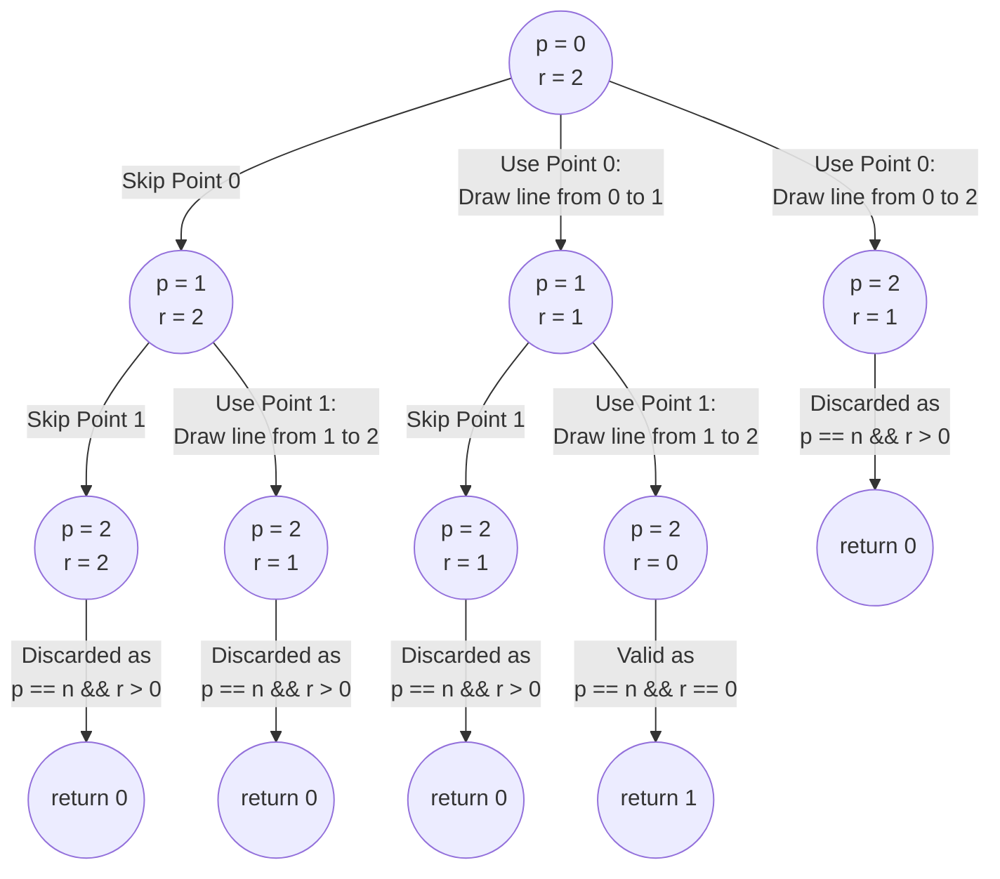

import Tabs from '@theme/Tabs';
import TabItem from '@theme/TabItem';


#  Subsets of Array Elements

This page offers detailed explanations and Java solutions for problems which involve selection an array elements into subsets, using the Combination technique.


## Partition to K Equal Sum Subsets

The problem description can be found at [Leetcode 698. Partition to K Equal Sum Subsets](https://leetcode.com/problems/partition-to-k-equal-sum-subsets/description/)


### Explanation 

This problem can be solved using a backtracking approach. This means that for each element in the array, we attempt to assign it to one of the $k$ subsets. However, the time complexity of this approach can be exponential \
($k^N$), where $N$ represents the number of elements.

A more efficient alternative is the combination approach. Despite having the flexibility to reuse any of the $k$ subsets for array elements, we recognize the stopping point because each subset should have the same total.

Hence, a better approach is to explore all combinations of the array, progressively forming subsets until each \
one contains an equal sum, resulting in $2^N$ time complexity.


Let's take the sample input as below,

<br />
$$
\text{nums} = \begin{bmatrix}
1,2,3
\end{bmatrix}, \ 
\text{k} = 2
$$
<br />

Initially, we'll verify if the total array sum can be evenly divided into $k$ parts by confirming that 
<br />
$$
\text{totalArraySum} \  \% \ k  = \ 0.
$$
<br />

Next, we will begin by creating a subset using choose or skip approach, that sums to the required sum and repeat the process until $k$ subsets are formed.


### Implementation

<Tabs>
  <TabItem value="Java" label="Java" default>

```java
import java.util.HashMap;

class Solution {

    private HashMap<Integer, Boolean> memo;

    // Checks if the array can be partitioned into k subsets with equal sums
    public boolean canPartitionKSubsets(int[] nums, int k) {
        memo = new HashMap<>();

        int totalArraySum = 0;
        for (int num : nums) {
            totalArraySum += num;
        }

        // If the total sum is not divisible by k, return false
        if (totalArraySum % k != 0) {
            return false;
        }

        return combination(nums, 0, 0, 0, totalArraySum / k, k);
    }

    // Helper function to find subsets with required sum
    private boolean combination(int[] nums, int mask, int index, int sum, 
      int requiredSum, int k) {
        if (memo.containsKey(mask)) return memo.get(mask);

        if (k == 0) {
            return true;
        } else if (sum > requiredSum) {
            return false;
        } else if (sum == requiredSum) {
            // Recursive call to find subsets with reduced k
            boolean ans = combination(nums, mask, 0, 0, requiredSum, k - 1);
            memo.put(mask, ans);
            return ans;
        }

        if (index == nums.length) return false;

        // Choose the current element and explore subsets
        if (((mask >> index) & 1) == 0) {
            mask = (mask | (1 << index));
            if (combination(nums, mask, index + 1, sum + nums[index], 
              requiredSum, k)) {
                memo.put(mask, true);
                return true;
            }
            mask = (mask ^ (1 << index)); // Unchoose the current element
        }
        // Move to the next element without choosing the current one
        if (combination(nums, mask, index + 1, sum, requiredSum, k)) {
            memo.put(mask, true);
            return true;
        }
        memo.put(mask, false);
        return false;
    }
}
```
</TabItem>
</Tabs>


### Complexity 

Let's say there are $N$ elements in an array.

#### Time complexity 
$
O(N \ . \ 2^{N})
$


#### Space complexity
$
O(2^{N})
$
<br />


:::info 

In this solution we have avoided redundant computations by adding memoization. 

Consider if we've chosen the $0$<sup>th</sup> and $1$<sup>st</sup> elements in set $1$ and the $2$<sup>nd</sup> and $3$<sup>rd</sup> elements in set $2$, but then found 
we can't make set $3$ with the remaining items, we remember this situation.

If in different recursive calls, we selected the $0$<sup>th</sup> and $3$<sup>rd</sup> elements in set $1$, and the $1$<sup>st</sup> and $2$<sup>nd</sup> elements in set $2$, rather than rechecking if we can create set $3$, we retrieve the previously stored answer (false) from memory.

:::

<br />

## Similar questions

Here are some more questions that can be solved using the same technique.


### String Compression II

The problem description can be found at [Leetcode 1531. String Compression II](https://leetcode.com/problems/string-compression-ii/description/)


<details>
  <summary>Solution</summary>

<Tabs>
  <TabItem value="Java" label="Java" default>

```java
import java.util.HashMap;

class Solution {
    // Memoization to store calculated results
    private HashMap<String, Integer> memo = new HashMap<>();

    public int getLengthOfOptimalCompression(String s, int k) {
        return combinations(s, 0, '0', 0, k);
    }

    /**
     * Recursive function to find the length of optimal compression.
     */
    private int combinations(String s, int index, char prevChar, 
      int prevCharCount, int k) {
        // Base case: If 'k' is negative, return a high value
        if (k < 0) return Integer.MAX_VALUE / 2;

        // Base case: If reached end of string, return 0
        if (index == s.length()) return 0;

        // Generate unique key for memoization
        String key = index + " " + k + " " + prevChar + " " + prevCharCount;
        if (memo.containsKey(key)) return memo.get(key);

        // Recursive call to find optimal compression length
        int delete = combinations(s, index + 1, prevChar, prevCharCount, k - 1);
        int keep = Integer.MAX_VALUE;

        // Check if current character matches previous character
        if (s.charAt(index) == prevChar) {
            int prevLength = String.valueOf(prevCharCount).length();
            int newLength = String.valueOf(prevCharCount + 1).length();
            int length = (prevCharCount == 1 || prevLength != newLength) ? 1 : 0;
            keep = length + combinations(
                              s, 
                              index + 1, 
                              prevChar, 
                              prevCharCount + 1, 
                              k);
        } else {
            keep = 1 + combinations(s, index + 1, s.charAt(index), 1, k);
        }

        // Calculate the minimum of delete and keep
        int res = Math.min(delete, keep);
        memo.put(key, res);
        return res;
    }
}
```
</TabItem>
</Tabs>
</details>


<br />

### Number of Sets of K Non-Overlapping Line Segments

The problem description can be found at [Leetcode 1621. Number of Sets of K Non-Overlapping Line Segments](https://leetcode.com/problems/string-compression-ii/description/)


The combination tree will appear as shown below for the sample input $n = 3$ and $k = 2$, where $p$ represents the point index and $r$ denotes the required lines.

<br />
<div style={{textAlign:"center"}}>



</div>
<br />

<details>
  <summary>Solution</summary>

<Tabs>
  <TabItem value="Java" label="Java" default>

```java
class Solution {
    private int MOD = (int) 1e9 + 7;
    private int[][] memo;
    private int[][] memoAll;

    // Function to find the number of sets
    public int numberOfSets(int n, int k) {
        memo = new int[n + 1][k + 1];
        memoAll = new int[n + 1][k + 1];

        // Initialize the memoization arrays
        for (int i = 0; i <= n; i++) {
            for (int j = 0; j <= k; j++) {
                memo[i][j] = -1;
                memoAll[i][j] = -1;
            }
        }

        // Call the combinations method to calculate the number of sets
        return combinations(0, n, k);
    }

    // Recursive function to calculate combinations
    private int combinations(int start, int n, int remaining) {
        // If the result for current start and remaining exists in memo, return it
        if (memo[start][remaining] != -1) return memo[start][remaining];
        
        // Base cases
        if (remaining == 0) return 1;
        if (start == n) return 0;

        // Skip the current point 
        int skip = combinations(start + 1, n, remaining);
        
        // Keep current point and start a line from the current point
        // Count calculation is pre calculated 
        int keep = getCombinationAllLines(start + 1, n, remaining - 1);
        int total = modAdd(keep, skip);

        // Memoize the result
        memo[start][remaining] = total;
        return total;
    }

    // Recursive function to calculate combinations for all lines
    private int getCombinationAllLines(int start, int n, int remaining) {
        if (memoAll[start][remaining] != -1) return memoAll[start][remaining];
        if (start == n) return 0;

        int res = modAdd(
          combinations(start, n, remaining), 
          getCombinationAllLines(start + 1, n, remaining)
        );
        memoAll[start][remaining] = res;
        return res;
    }

    // Function to perform modular addition
    private int modAdd(int a, int b) {
        int res = a + b;
        if (res < 0) res += MOD;
        return res % MOD;
    }
}
```
</TabItem>
</Tabs>
</details>

:::info[]
In this solution, retaining the current point doesn't result in a single output but enables the creation of multiple lines from that point onwards.

However, calculating line counts from a given point to all subsequent points on a 1D plane necessitates running a for loop. To enhance efficiency, we've utilized pre-calculation techniques via an integer array named memoAll.
:::
