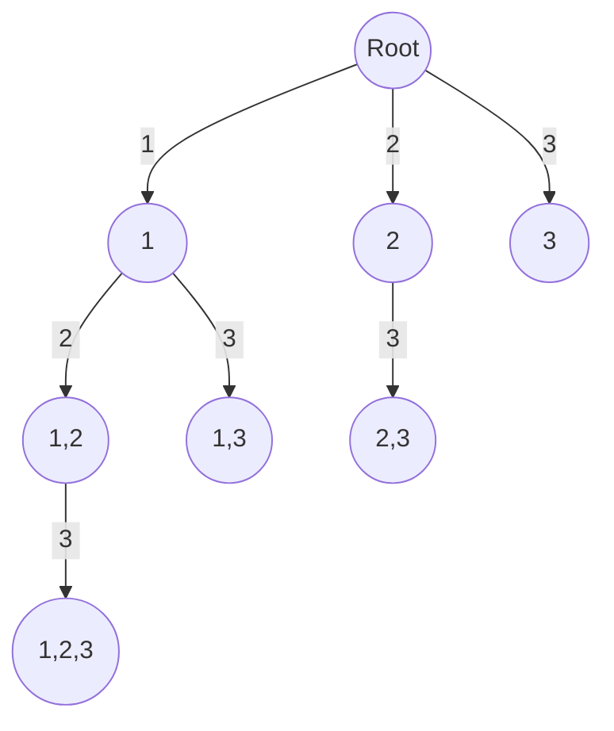
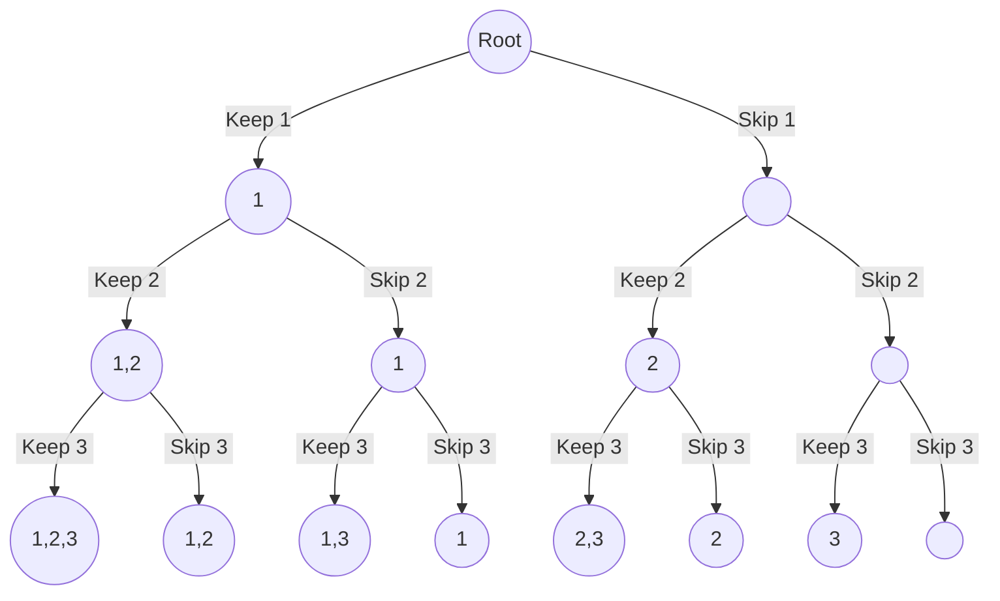

import Tabs from '@theme/Tabs';
import TabItem from '@theme/TabItem';


# Combinations
Combinations, represent selections of items where the order doesn't matter. 

<br />
$$
^nC_r= \frac{n!}{r!(n−r)!}
$$

<br />

The code for generating combinations can be implemented in two ways.

## Approach I

It uses a for loop to iterate over elements starting from the $\text{index}$ onward in a recursive call. Code execution tree will look like below.

<br />
<div style={{textAlign:"center"}}>



</div>
<br />

### Implementation

<Tabs>
  <TabItem value="Java" label="Java" default>

```java
import java.util.*;

class Solution {

    List<List<Integer>> res;

    // function to generate combinations elements from given array num
    public List<List<Integer>> combinations(int[] nums) {
        res = new ArrayList<>();

        // Sort the array to bring duplicates together.
        Arrays.sort(nums);
        
        // generate combinations
        solve(nums, 0, new boolean[nums.length], new ArrayList<>());
        return res;
    }

    private void solve(int[] nums, int index, boolean[] visited, List<Integer> list) {
        // add a subset to combination list
        res.add(new ArrayList<>(list));

        // start generating a new subset from current index
        for(int i = index; i < nums.length; i++) {
            if(visited[i]) continue;

            // if the current element is a duplicate 
            // and the previous element has not been used yet, avoid creating a subset
            if(i > 0 && nums[i] == nums[i - 1] && !visited[i - 1]) continue;

            visited[i] = true;
            list.add(nums[i]);
            solve(nums, i + 1, visited, list);
            list.remove(list.size() - 1);
            visited[i] = false;
        }
    }
}
```
</TabItem>
</Tabs>

### Complexity

Let's say there $N$ elements in an array

#### Time Complexity
$
O(2^N)
$

#### Space Complexity
$
O(N)
$
<br />

## Approach II 

It is keep or skip approach, where the algorithm creates two subsets, one with the current element and another without the current element. Code execution tree will look like below.

<div style={{textAlign:"center"}}>



</div>
<br />

### Implementation

<Tabs>
  <TabItem value="Java" label="Java" default>

```java
import java.util.*;

class Solution {

    List<List<Integer>> res;

   // function to generate combinations elements from given array num
    public List<List<Integer>> combinations(int[] nums) {
        res = new ArrayList<>();

        // Sort the array to bring duplicates together.
        Arrays.sort(nums);

        keepOrSkip(nums, 0, new ArrayList<>());
        return res;
    }

    private void keepOrSkip(int[] nums, int index, List<Integer> list) {
        if (index == nums.length) {
            // add a subset to combination list
            res.add(new ArrayList<>(list));
            return;
        }

        // keep the current element
        list.add(nums[index]);
        keepOrSkip(nums, index + 1, list);
        list.remove(list.size() - 1);

        // Skip duplicates
        while (index < nums.length - 1 && nums[index] == nums[index + 1]) {
            index++;
        }

        // Skip the current element
        keepOrSkip(nums, index + 1, list);
    }
}

```
</TabItem>
</Tabs>

### Complexity

Let's say there $N$ elements in an array

#### Time Complexity
$
O(2^N)
$

#### Space Complexity
$
O(N)
$
