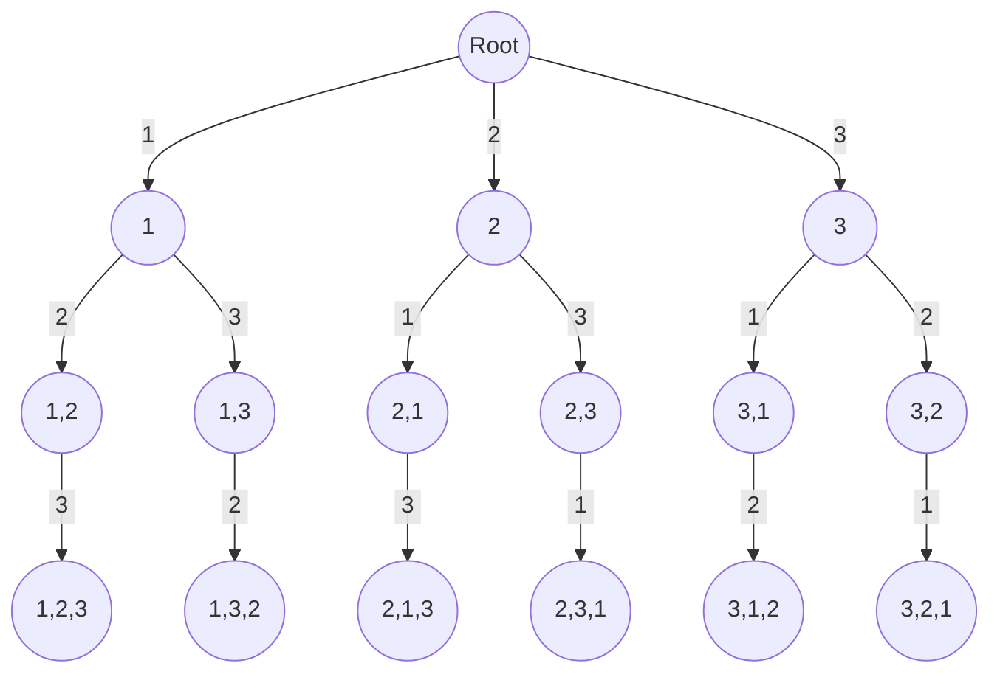
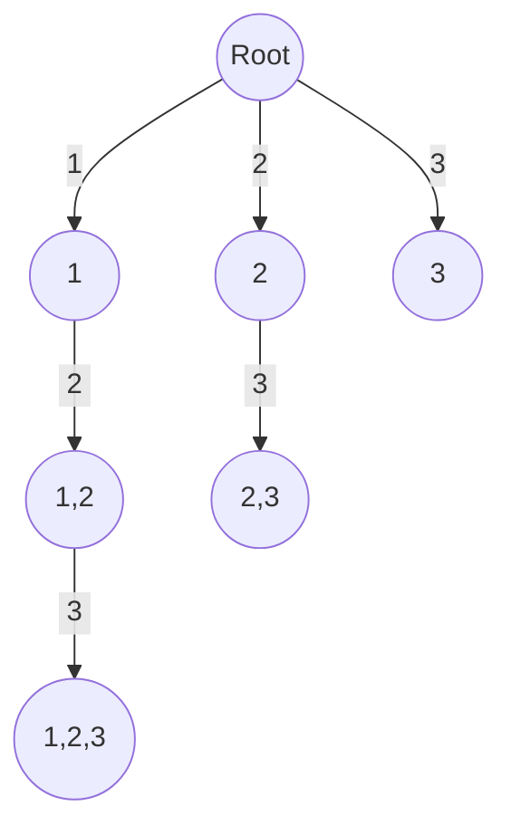

# Partition n objects among k people

Given an integer array num and integer $k$, partition/distribute num into $k$ non-empty sub-arrays such that ...


## Permutation approach

The Idea is for each recursive call, we will iterate over $N$ elements and make another recursive call. 

Assume we picked one element, then we iterate over the array and make recursive calls to remaining $N−1$ elements and so on.

Therefore, in the worst-case scenario, the total number of recursive calls will be

$$
N \ ⋅ \ (N−1) \ ⋅ \ (N−2) \ ⋅ \ ... \ ⋅ \ 2 \ ⋅ \ 1 \ = \ N!
$$

<br />

Let's say we have an array with $3$ elements as 
$
\begin{bmatrix}
1 & 2 & 3
\end{bmatrix}
$
, Permutation tree will look like below.


<br />
<div style={{textAlign:"center"}}>



</div>

<br />

### Java Implementation
```java
import java.util.ArrayList;
import java.util.Arrays;
import java.util.List;

/**
 * Generates unique permutations from the given array.
 * Example:
 * Input: nums = [1,1,2]
 * Output: [[1,1,2], [1,2,1], [2,1,1]]
**/
class Solution {

    private List<List<Integer>> res;

    public List<List<Integer>> permuteUnique(int[] nums) {
        res = new ArrayList<>();
        Arrays.sort(nums);
        solve(nums, 0, new boolean[nums.length], new ArrayList<>());
        return res;
    }

    // Backtracking method to generate unique permutations
    private void solve(int[] nums, int index, boolean[] visited, List<Integer> list) {
        if (list.size() == nums.length) {
            res.add(new ArrayList<>(list));
        } else {
            for (int i = 0; i < nums.length; i++) {
                if (visited[i]) continue;
								
		/**
		 * To prevent duplicate permutations, exclude the current element if 
		 * it matches the previous element and previous element is not 
		 * yet utilized within the ongoing permutation sequence.
		**/
                if (i > 0 && nums[i] == nums[i - 1] && !visited[i - 1]) continue;

                visited[i] = true;
                list.add(nums[i]);
                solve(nums, i + 1, visited, list);
                list.remove(list.size() - 1);
                visited[i] = false;
            }
        }
    }
}
```  

<br />

### Complexity 

Permutation approach has time complexity of $O(N!)$ and space complexity of $O(N)$ because maximum depth of recursive tree is at most $N$. 


<br />

## Combination Approach
At times, problems can be resolved without the need to arrange elements in specific order within subsets. In these cases, combination approach can be used.

In each recursive step, we go through elements following the current one, avoiding revisiting prior elements and perform another recursive call to remaining elements.


<br />
<div style={{textAlign:"center"}}>



</div>

<br />

### Java Implementation
```java
import java.util.ArrayList;
import java.util.List;

/**
 * Generates combinations from 1 to n, choosing k numbers.
 * Example:
 * Input: n = 3, k = 3
 * Output: [[],[1],[1,2],[1,2,3],[1,3],[2],[2,3],[3]]
**/
class Solution {

    private List<List<Integer>> res;

    public List<List<Integer>> combine(int n, int k) {
        res = new ArrayList<>();
        solve(1, n, k, new ArrayList<>());
        return res;
    }

    // Backtracking method to generate combinations
    private void solve(int index, int n, int k, List<Integer> list) {
        res.add(new ArrayList<>(list));
        for (int i = index; i <= n; i++) {
            list.add(i);
            solve(i + 1, n, k, list);
            list.remove(list.size() - 1);
        }
    }
}
```

<br />

### Complexity

Combination approach has time complexity of $O(2^N)$ and space complexity of $O(N)$ because maximum depth of recursive tree is at most $N$. 


<br />

## Sample questions

[698. Partition to K Equal Sum Subsets](https://leetcode.com/problems/partition-to-k-equal-sum-subsets/) \
[416. Partition Equal Subset Sum](leetcode.com/problems/partition-equal-subset-sum/description/) 

Above questions uses Combination approach to generate all possible subsets, with Bitmasking and Memoization. 


<details>
  <summary>Solution</summary>

```java
import java.util.*;

class Solution {

    private HashMap<Integer, Boolean> memo;

    public boolean canPartitionKSubsets(int[] nums, int k) {
        memo = new HashMap<>();

        Arrays.sort(nums);
        reverse(nums);

        int sum = 0;
        for (int i = 0; i < nums.length; i++) {
            sum += nums[i];
        }

        if (sum % k != 0) {
            return false;
        } else {
            return helper(nums, 0, 0, 0, sum / k, 0, k);
        }
    }

    private boolean helper(int[] nums, int index, int visited, int sum,
                           int requiredSum, int count, int k) {
        if (count == k) {
            return true;
        }

        /**
         * Consider a scenario in which we have picked the 0th and 1st elements
         * in set 1 and the 2nd and 3rd elements in set 2, but now we can't make
         * set 3 using the remaining elements. We can store that and later 
         * if we have picked 0th, 1st, 2nd, and 3rd elements, 
         * in any other combination we can return the stored answer.
         */
        if (memo.containsKey(visited)) {
            return memo.get(visited);
        }

        if (sum == requiredSum) {
            boolean ans = helper(nums, 0, visited, 0, requiredSum, count + 1, k);
            memo.put(visited, ans);
            return ans;
        }

        if (sum > requiredSum) {
            memo.put(visited, false);
            return false;
        }

        for (int i = index; i < nums.length; i++) {
            if (((visited >> i) & 1) == 1) {
                continue;
            }

            visited = (visited | 1 << i);
            boolean ans = helper(nums, i + 1, visited, sum + nums[i],
                    requiredSum, count, k);
            memo.put(visited, ans);
            if (ans) {
                return true;
            }
            visited = (visited ^ (1 << i));
        }
        memo.put(visited, false);
        return false;
    }

    private void reverse(int[] nums) {
        int i = 0, j = nums.length - 1;
        while (i < j) {
            int temp = nums[i];
            nums[i] = nums[j];
            nums[j] = temp;
            i++;
            j--;
        }
    }
}
```
</details>