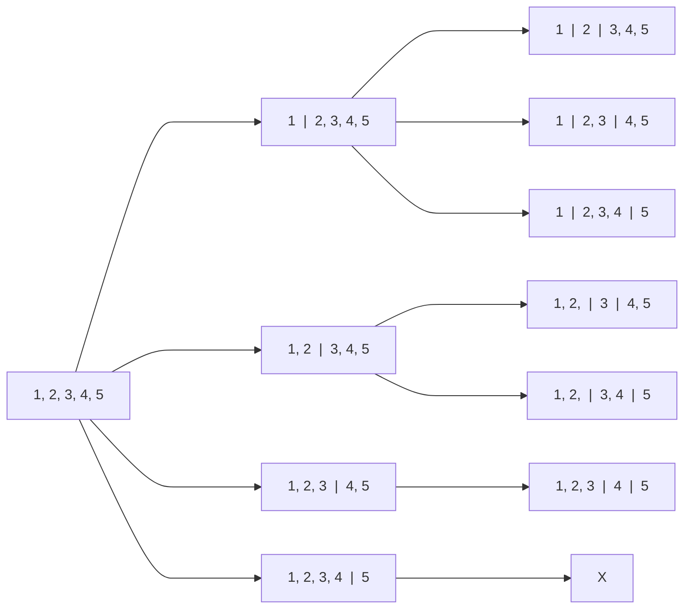

# Split n objects among k people

Given an integer array nums and an integer $k$, split nums into $k$ non-empty subarrays such that ...

## Star and Bar approach

Stars and Bars is a technique to distribute indistinguishable objects into groups, using stars to represent objects and bars to separate groups.


Let's say we have below array with $5$ elements and we want to split it into $2$ subarray. 


$$
\begin{bmatrix}
\ 1, & 2, & 3, & 4, & 5 \
\end{bmatrix}
$$

<br />

To divide an array into $2$ sub-arrays, we require placing $1$ bar or partition, which can be done in $4$ distinct ways, as illustrated below

$$
\begin{bmatrix}
\ 1 & | \ \ \ 2, & 3, & 4, & 5 \ 
\end{bmatrix}
$$

$$
\begin{bmatrix}
\ 1, & 2 & | \ \ \ 3, & 4, & 5 \
\end{bmatrix}
$$


$$
\begin{bmatrix}
\ 1, & 2, & 3 & | \ \ \ 4, & 5 \ 
\end{bmatrix}
$$

$$
\begin{bmatrix}
\ 1, & 2, & 3, & 4 & | \ \ \ 5 \
\end{bmatrix}
$$


<br />


:::info[note]
Because question specifies non-empty sub-arrays, we opt not to include the choice of empty arrays.
:::

<br />

Here's the code execution tree for an array of 5 elements, demonstrating the creation of 3 sub-arrays.

<br />

<div style={{textAlign:"left"}}>



</div>

<br />
<br />


### Java Implementation

```java
import java.util.*;

class IndexRange {
    int from, to;

    IndexRange(int from, int to) {
        this.from = from;
        this.to = to;
    }

    @Override
    public String toString() {
        return "(" + from + ", " + to + ")";
    }
}

class Solution {

    // Method to split array into k sub-arrays
    public void splitArray(int[] nums, int k) {
        // Helper function call to find all valid combinations
        List<List<IndexRange>> ans = helper(nums, 0, k, new ArrayList<IndexRange>());
        
        // Displaying the valid combinations
        for (List<IndexRange> l : ans) {
            System.out.println(l);
        }
    }

    // Helper function to generate all valid sub-arrays combinations
    private List<List<IndexRange>> helper(int[] nums, int index, int k, 
		List<IndexRange> s) {
        // Base cases for recursion termination
        if (index >= nums.length) {
            return new ArrayList<List<IndexRange>>();
        }
        if (k == 1) {
            // If only one sub-array is left, add the remaining range to the result
            List<List<IndexRange>> res = new ArrayList<List<IndexRange>>();
            s.add(new IndexRange(index, nums.length - 1));
            res.add(new ArrayList<IndexRange>(s));
            s.remove(s.size() - 1);
            return res;
        }

        // Recursive exploration to find valid combinations
        List<List<IndexRange>> res = new ArrayList<List<IndexRange>>();
        for (int i = index; i < nums.length; i++) {
            s.add(new IndexRange(index, i));
            List<List<IndexRange>> subList = helper(nums, i + 1, k - 1, s);
            res.addAll(subList);
            s.remove(s.size() - 1);
        }
        return res;
    }
}
```

### Complexity

To create $3$ subarrays, we select $2$ position out of the $4$ available positions for the bar, which gives us time complexity of  $^4 𝐶_2$.