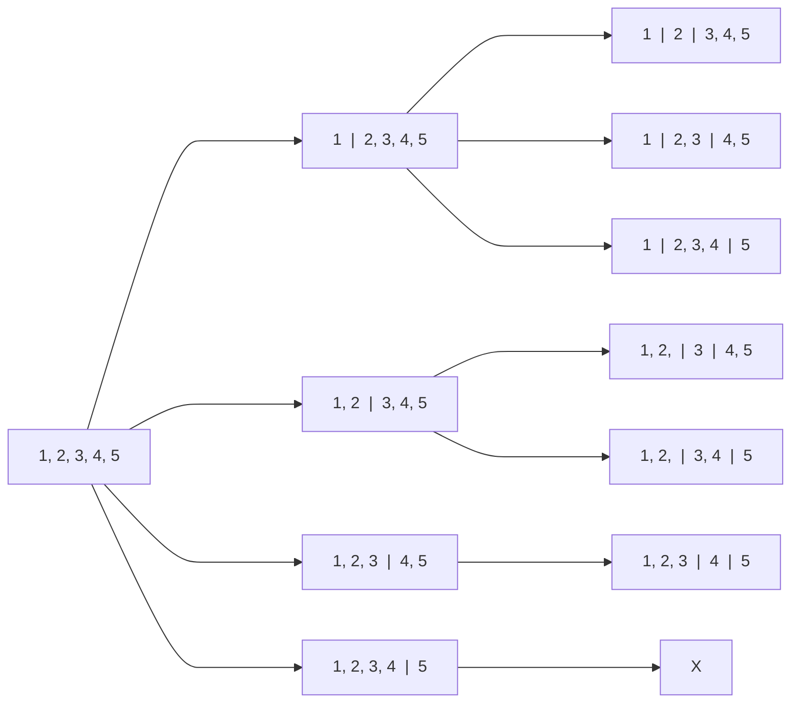

# Split n objects among k people

Given an integer array nums and an integer $k$, split nums into $k$ non-empty subarrays such that ...

## Star and Bar approach

Stars and Bars is a technique to distribute indistinguishable objects into groups, using stars to represent objects and bars to separate groups.


Let's say we have below array with $5$ elements and we want to split it into $2$ subarray. 


$$
\begin{bmatrix}
\ 1, & 2, & 3, & 4, & 5 \
\end{bmatrix}
$$

<br />

To divide an array into $2$ sub-arrays, we require placing $1$ bar or partition, which can be done in $4$ distinct ways, as illustrated below

$$
\begin{bmatrix}
\ 1 & | \ \ \ 2, & 3, & 4, & 5 \ 
\end{bmatrix}
$$

$$
\begin{bmatrix}
\ 1, & 2 & | \ \ \ 3, & 4, & 5 \
\end{bmatrix}
$$


$$
\begin{bmatrix}
\ 1, & 2, & 3 & | \ \ \ 4, & 5 \ 
\end{bmatrix}
$$

$$
\begin{bmatrix}
\ 1, & 2, & 3, & 4 & | \ \ \ 5 \
\end{bmatrix}
$$


<br />


:::info[note]
Because question specifies non-empty sub-arrays, we opt not to include the choice of empty arrays.
:::

<br />

Here's the code execution tree for an array of 5 elements, demonstrating the creation of 3 sub-arrays.

<br />

<div style={{textAlign:"left"}}>



</div>

<br />
<br />


### Java Implementation

```java
import java.util.*;

class IndexRange {
    int from, to;

    IndexRange(int from, int to) {
        this.from = from;
        this.to = to;
    }

    @Override
    public String toString() {
        return "(" + from + ", " + to + ")";
    }
}

class Solution {

    // Method to split array into k sub-arrays
    public void splitArray(int[] nums, int k) {
        // Helper function call to find all valid combinations
        List<List<IndexRange>> ans = helper(nums, 0, k, new ArrayList<IndexRange>());
        
        // Displaying the valid combinations
        for (List<IndexRange> l : ans) {
            System.out.println(l);
        }
    }

    // Helper function to generate all valid sub-arrays combinations
    private List<List<IndexRange>> helper(int[] nums, int index, int k, 
		List<IndexRange> s) {
        // Base cases for recursion termination
        if (index >= nums.length) {
            return new ArrayList<List<IndexRange>>();
        }
        if (k == 1) {
            // If only one sub-array is left, add the remaining range to the result
            List<List<IndexRange>> res = new ArrayList<List<IndexRange>>();
            s.add(new IndexRange(index, nums.length - 1));
            res.add(new ArrayList<IndexRange>(s));
            s.remove(s.size() - 1);
            return res;
        }

        // Recursive exploration to find valid combinations
        List<List<IndexRange>> res = new ArrayList<List<IndexRange>>();
        for (int i = index; i < nums.length; i++) {
            s.add(new IndexRange(index, i));
            List<List<IndexRange>> subList = helper(nums, i + 1, k - 1, s);
            res.addAll(subList);
            s.remove(s.size() - 1);
        }
        return res;
    }
}
```

### Complexity

To create $3$ subarrays, we select $2$ position out of the $4$ available positions for the bar, which gives us time complexity of  $^4 𝐶_2$.


## Binary Search Approach

Often, split array into sub-arrays questions can be solved by repeatedly applying binary search to meet the specified conditions.

Imagine a problem where you need to minimize the largest sum among subarrays after partitioning an array.

<br />

$$
\text{nums} = \begin{bmatrix}
7, & 2, & 5 & 10 & 8
\end{bmatrix}, 
\  \text{partition} = 2
$$

<br />

Here, initiate the binary search using the largest array value as the low threshold and the total sum of the array as the high threshold.

$$
\text{lo} = 10, \ \text{hi} = 32, \ \text{mid} = 21
$$

<br />

Assuming maximum sum of $21$, the first subarray will have $\begin{bmatrix}7, & 2, & 5\end{bmatrix}$, and the second subarray will have $\begin{bmatrix}10, & 8\end{bmatrix}$. Since none of the subarray sums exceed value of $21$, let's lower the upper threshold to minimize search value further.

$$
\text{lo} = 10, \ \text{hi} = 21, \ \text{mid} = 15
$$

<br />

With a maximum sum of $15$, we can't form two subarrays. The first subarray $\begin{bmatrix}7, & 2, & 5\end{bmatrix}$ is fine, but the second subarray $\begin{bmatrix}10, & 8\end{bmatrix}$ exceeds the max sum of $15$. Let's increase the lower threshold.

$$
\text{lo} = 16, \ \text{hi} = 21, \ \text{mid} = 18
$$

<br />

With a maximum sum of $18$, we made two subarrays the first with numbers $\begin{bmatrix}7, & 2, & 5\end{bmatrix}$ and the second with numbers $\begin{bmatrix}10, & 8\end{bmatrix}$. Since none of the subarray sums exceed value of $18$ let's lower the upper threshold to minimize search value further.

$$
\text{lo} = 16, \ \text{hi} = 18 \ \text{mid} = 17
$$

<br />

With a maximum sum of $17$, we can't form two subarrays. The first subarray $\begin{bmatrix}7, & 2, & 5\end{bmatrix}$ is fine, but the second subarray $\begin{bmatrix}10, & 8\end{bmatrix}$ exceeds the max sum of $17$. Let's increase the lower threshold.

$$
\text{lo} = 18, \ \text{hi} = 18 \ \text{mid} = 18
$$

<br />


Since the lower limit equals the upper limit, we exit the binary search, finding the answer as $18$.


### Java Implementation
```java
class Solution {
    public int splitArray(int[] nums, int k) {
        // Initialize the lower and upper bounds for binary search
        int lo = Integer.MIN_VALUE;
        int hi = 0;
        
        // Determine the bounds for the binary search
        for (int num : nums) {
            lo = Math.max(lo, num); 
            hi += num; 
        }

        // Perform binary search
        while (lo < hi) {
            int mid = lo + (hi - lo) / 2; 
            // Check if more partitions are needed
            boolean isMore = isMorePartition(nums, mid, k); 
            if (isMore)
                lo = mid + 1; 
            else
                hi = mid; 
        }
        return lo; 
    }

    // Helper function to check if more partitions are required
    private boolean isMorePartition(int[] nums, int required, int k) {
        int index = 0, sum = 0, partition = 1;

        // Iterate through the array to check for partitions
        while (index < nums.length) {
            sum += nums[index]; // Accumulate the sum
            if (sum > required) {
                sum = nums[index]; // Reset the sum for a new partition
                partition++; // Increment the partition count
            }
            index++; // Move to the next element

            if (partition > k)
                return true; // If partitions exceed the given count, return true
        }
        return false; // Return false if partitions are within the given count
    }
}
```

## Sample questions

[1011. Capacity To Ship Packages Within D Days](https://leetcode.com/problems/capacity-to-ship-packages-within-d-days/) 

<details>
  <summary>Solution</summary>

```java
class Solution {
    public int shipWithinDays(int[] weights, int days) {
        int lo = Integer.MIN_VALUE;
        int hi = 0;

        // Determine the bounds for the binary search
        for (int weight : weights) {
            lo = Math.max(lo, weight); d
            hi += weight; 
        }

        // Perform binary search to find the minimum capacity
        while (lo < hi) {
            int mid = lo + (hi - lo) / 2;
            // Check if more days are required
            boolean isMoreDays = daysRequired(weights, mid, days); 
            if (isMoreDays)
                lo = mid + 1; 
            else
                hi = mid; 
        }
        return lo; // Return the minimum capacity
    }

    // Helper function to check if more days are required based on the capacity
    private boolean daysRequired(int[] weights, int capacity, int days) {
        int requiredDays = 1, index = 0, sum = 0;

        // Iterate through the weights to determine the required days
        while (index < weights.length) {
            sum += weights[index]; // Accumulate the sum of weights
            if (sum > capacity) {
                sum = weights[index]; // Reset the sum for a new day
                requiredDays++; // Increment the required days
            }
            index++; // Move to the next weight

            if (requiredDays > days)
                return true; // If required days exceed the given limit
        }
        return false; // If required days are within the given limit
    }
}	
```
</details>