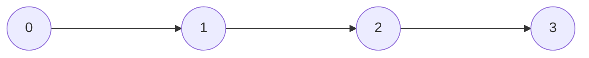
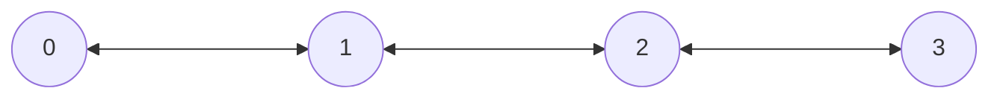
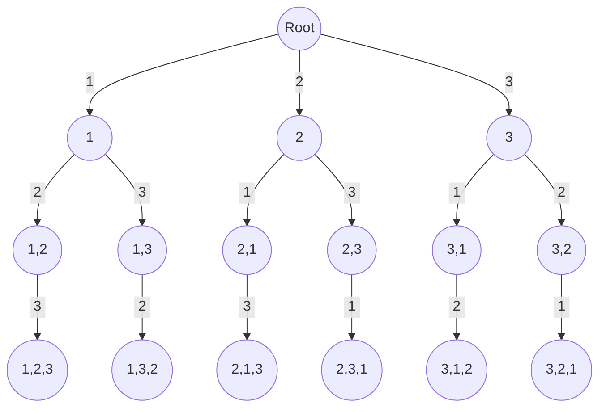

import ProblemList from '@site/src/components/ProblemList'; 

# Home

Hey there and a warm welcome to Coding Cargo!

I'm Vishal, and codingcargo.com is a space where I tackle challenging coding problems from various websites. \
If you find these solutions helpful, I'd love for you to share them with others.

 

<ProblemList />

 

### Array
$
\begin{bmatrix}
1, 2, 3 
\end{bmatrix}
$

 
 

### 2D Array
$
\begin{bmatrix}
1 & 2 & 3 \\
4 & 5 & 6 \\
7 & 8 & 9 \\
\end{bmatrix}
$

 
 

### HashMap
$
1 \rightarrow \begin{bmatrix}2 & 3 & 4 \end{bmatrix} \\
2 \rightarrow \begin{bmatrix}4 & 5 & 6 \end{bmatrix} \\
$

 
 

### Linked List

 
 

### Doubly Linked List

 
 

### Tree

