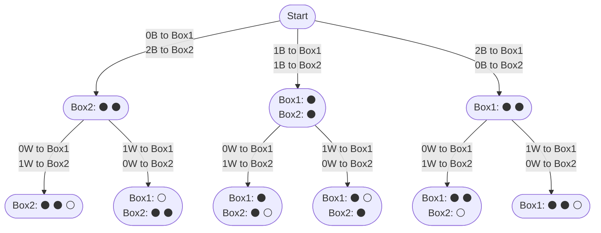

import Tabs from '@theme/Tabs';
import TabItem from '@theme/TabItem';

# 1467. Probability of a Two Boxes...

The problem description can be found at [Leetcode 1467. Probability of a Two Boxes Having The Same Number of Distinct Balls](https://leetcode.com/problems/probability-of-a-two-boxes-having-the-same-number-of-distinct-balls/description/).

## Explanation

This problem can be solved using the Backtracking technique to partition an array into $K$ subarrays. More such questions can be found [here](/backtracking/partition-array-into-k-subarrays).

Let's take the sample input below,

$$
\text{balls} = [2,1]
$$

Here we also assume $2$ balls have Black(B) color, whereas $1$ ball has White(W) color.

<div style={{textAlign:"center"}}>


</div>

Once we have all the distribution possibilities ready, we count the ones that satisfy the given condition and calculate the probability.

Here, we also calculate the combinations to determine how many different ways we can choose $1$ Black(B) ball from a bag containing $2$ Black(B) balls. For e.g. in one combination we can choose $1^{\text{st}}$ Black(B) ball vs in another combination we can choose $2^{\text{nd}}$ Black(B) ball.


## Implementation

<Tabs>
  <TabItem value="Java" label="Java" default>

```java
class Solution {
    // Array to store factorials
    double[] factorial = new double[49]; 

    // Main method to calculate probability
    public double getProbability(int[] balls) {
        int sum = 0;
        // Calculate total number of balls
        for (int i = 0; i < balls.length; i++) {
            sum += balls[i];
        }

        // Calculate factorials for later use
        factorial[0] = 1;
        for (int i = 1; i < 49; i++) {
            factorial[i] = factorial[i - 1] * i;
        }

        // Calculate valid cases
        double valid = backtrack(balls, 0, 0, 0, 0, 0); 
        // Calculate total combinations
        double total = combinations(sum, sum / 2); 

        // Return probability
        return valid / total; 
    }

    // Backtracking method to calculate valid cases
    private double backtrack(int[] balls, int index, int box1Color, int box2Color,
      int box1Count, int box2Count) {

        if (index == balls.length) {
            // Check if counts and colors match for both boxes
            return box1Count == box2Count && box1Color == box2Color ? 1 : 0;
        } else {
            double res = 0;
            /*
             * Assign i balls from balls[index] to first box and 
             * balls[index] - i to second box
             */
            for (int i = 0; i <= balls[index]; i++) {
                double combinations = combinations(balls[index], i);
                res += backtrack(
                  balls, index + 1,
                  i > 0 ? box1Color + 1 : box1Color,
                  i < balls[index] ? box2Color + 1 : box2Color,
                  box1Count + i,
                  box2Count + (balls[index] - i)
                ) * combinations;
            }
            return res;
        }
    }

    // Method to calculate combinations using factorials
    private double combinations(int n, int r) {
        return factorial[n] / factorial[n - r] / factorial[r];
    }
}
```
</TabItem>
</Tabs>

## Complexity

Let $N$ be the length of the input array $\text{balls}$

### Time complexity 

Each of the $N$ indices in the input array has $2$ boxes to choose from. 

$$
O(2 ^ N)
$$


:::info
This is not the exact time complexity, as it does not account for the time required to distribute elements at any of the $N$ indices into $2$ boxes.
:::

### Space complexity

Since there are $N$ indices to assign to each box, the stack size for the backtracking will be $N$.

$$
O(N)
$$

