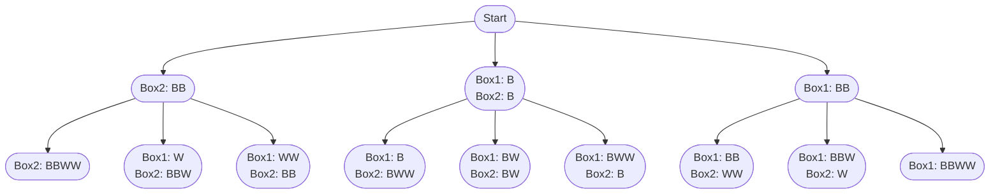

import Tabs from '@theme/Tabs';
import TabItem from '@theme/TabItem';

# 1467. Probability of a Two Boxes...

This page provides solutions for the leetcode problem [1467. Probability of a Two Boxes Having The Same Number of Distinct Balls](https://leetcode.com/problems/probability-of-a-two-boxes-having-the-same-number-of-distinct-balls/description/).

## Problem Explanation

The problem requires us to calculate the probability that two boxes will have the same number of distinct balls after shuffling $2\text{N}$ balls into two boxes, such that each box containing $\text{N}$ balls.

For example, let's say box $1$ has $4$ balls of $2$ colors, Red and Black, and box $2$ has $4$ balls of $2$ colors, Black and Blue. It does not matter which specific colors each box contains, but rather how many distinct colors each box contains.


## Solution

For this problem, we need to consider all possible distribution possibilities. Therefore, we use the backtracking technique. [More such problem can be found here](/backtracking/partition-array-into-k-subarrays).


Let's take the sample input below,

$$
\text{balls} = [2,2]
$$

:::info[Assumption]
Assume $2$ balls at $0^{th}$ index have Black(B) color, whereas $2$ balls at $1^{st}$ index has White(W) color. 
:::

We start by distributing $2$ Black balls into $2$ boxes. 

There are $3$ ways to distribute $2$ indistinguishable Black balls among $2$ boxes: 

- $0$ Black Balls to Box$1$ and $2$ Black Balls to Box$2$.
- $1$ Black Ball to Box$1$ and $1$ Black Ball to Box$2$.
- $2$ Black Balls to Box$1$ and $0$ Black Balls to Box$2$.

Since each Black Ball is considered distinct, there are actually $4$ ways to distribute them, as there are $2$ ways to choose $1$ black ball from the $2$ black balls. 

The total distribution possibilities are as follows:

- $0$ Black Balls to Box$1$ and $2$ Black Balls to Box$2$.
- First Black Ball to Box$1$ and the Second Black Ball to Box$2$.
- Second Black Ball to Box$1$ and the First Black Ball to Box$2$.
- $2$ Black Balls to Box$1$ and $0$ Black Balls to Box$2$.

Similarly, we will distribute $2$ distinct White balls into $2$ boxes.

Below is a graphical representation of the distribution of $2$ Black balls and $2$ White balls: 

<div style={{textAlign:"center"}}>


</div>

:::info[]
Notice that in the above graphical representation, we do not consider the 2 black balls as distinct. We account for this by calculating the combination values in the code.
:::

Once we have all the distribution possibilities ready, we count the ones that satisfy the given condition and calculate the probability using the formula:

$$
\text{Valid distributions} \div \text{Total distributions}
$$


## Implementation

<Tabs>
  <TabItem value="Java" label="Java" default>

```java
class Solution {
    double[] factorial = new double[49]; 

    public double getProbability(int[] balls) {
        int sum = 0;
        for (int i = 0; i < balls.length; i++) {
            sum += balls[i];
        }

        factorial[0] = 1;
        for (int i = 1; i < 49; i++) {
            factorial[i] = factorial[i - 1] * i;
        }

        double valid = backtrack(balls, 0, 0, 0, 0, 0); 

        double total = combinations(sum, sum / 2); 

        return valid / total; 
    }

    private double backtrack(int[] balls, int index, int box1Color, int box2Color,
      int box1Count, int box2Count) {

        if (index == balls.length) {
            return box1Count == box2Count && box1Color == box2Color ? 1 : 0;
        } else {
            double res = 0;
            for (int i = 0; i <= balls[index]; i++) {
                double combinations = combinations(balls[index], i);
                res += backtrack(
                  balls, index + 1,
                  i > 0 ? box1Color + 1 : box1Color,
                  i < balls[index] ? box2Color + 1 : box2Color,
                  box1Count + i,
                  box2Count + (balls[index] - i)
                ) * combinations;
            }
            return res;
        }
    }

    private double combinations(int n, int r) {
        return factorial[n] / factorial[n - r] / factorial[r];
    }
}
```
</TabItem>
</Tabs>

## Complexity

Let $\text{N}$ be the length of the input array $\text{balls}$

### Time complexity 

Each of the $\text{N}$ indices in the input array has $2$ boxes to choose from. 

$$
\text{O}(2 ^ \text{N})
$$


:::info[]
Here, we ignore time complexity required to distribute elements at each of the $\text{N}$ indices into $2$ boxes, because the input constraint $1 \leq \text{balls}[\text{i}] \leq 6$ ensures that this number will be very small.
:::

### Space complexity

Since there are $\text{N}$ indices to assign to each box, the stack size for the backtracking will be $\text{N}$.

$$
\text{O}(\text{N})
$$

