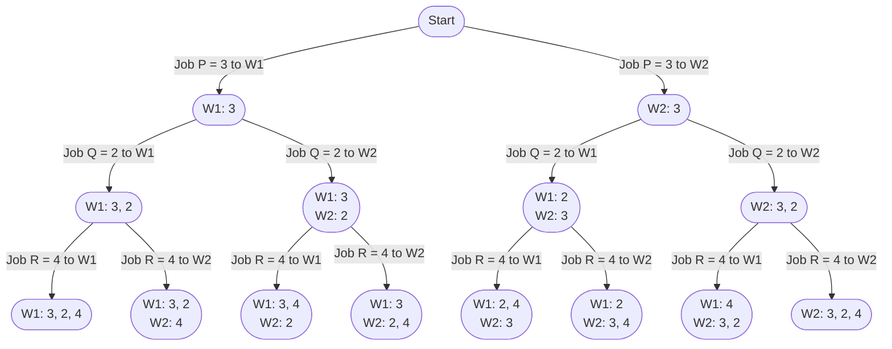

import Tabs from '@theme/Tabs';
import TabItem from '@theme/TabItem';

# 1723. Find Minimum Time to Fini...

This page provides solutions for the leetcode problem [Leetcode 1723. Find Minimum Time to Finish All Jobs](https://leetcode.com/problems/find-minimum-time-to-finish-all-jobs/description/).

## Problem Explanation

The problem is asking us to divide the jobs among $\text{K}$ workers in such a way the maximum working time of any worker is minimized.

## Solution

For this problem, we need to consider all possible distribution possibilities. Therefore, we use the backtracking technique. [More such problem can be found here](/backtracking/partition-array-into-k-subarrays).

Let's take the sample input below,

$$
\text{jobs} = [3,2,4], \ \text{K} = 2
$$

:::info[Assumption]
Assume job which takes $3$ units of time is called $\text{P}$, job which takes $2$ units of time is called $\text{Q}$ and job which takes $4$ units of time is called $\text{R}$.
:::

We start by assigning $\text{P}$ jobs among $2$ workers, which gives us $2$ possibilities. Next we assign $\text{Q}$ and $\text{R}$ jobs in the next iterations, which gives us total of $8$ possibilities.

Below is a graphical representation of the distribution of $3$ jobs $\text{P}, \text{Q}, \text{R}$ among $2$ workers: 

<div style={{textAlign:"center"}}>


</div>


We calculate maximum working time for each distribution. For example, in the distribution $\text{W1}: 3, 2$ and $\text{W2}:4$ maximum working time is for the worker $\text{W1}$ with the value of $5$. 

Finally, we compare maximum working time value for each distribution and find minimum among all distributions.


## Implementation

<Tabs>
  <TabItem value="Java" label="Java" default>

```java
class Solution {
    private int min = Integer.MAX_VALUE;

    public int minimumTimeRequired(int[] jobs, int k) {
        backtrack(jobs, 0, new int[k]);
        return min;
    }

    private void backtrack(int[] jobs, int index, int[] workers) {
        if (index == jobs.length) {
            min = Math.min(min, max(workers));
        } else {
            for (int i = 0; i < workers.length; i++) {
                if (i > 0 && workers[i] == workers[i - 1]) continue;

                if (workers[i] + jobs[index] > min) continue;

                workers[i] += jobs[index];
                backtrack(jobs, index + 1, workers);
                workers[i] -= jobs[index];
            }
        }
    }

    // Method to find the maximum value in an array
    private int max(int[] array) {
        int maxValue = Integer.MIN_VALUE;
        // Find the maximum value in the array
        for (int i = 0; i < array.length; i++) {
            maxValue = Math.max(maxValue, array[i]);
        }
        return maxValue;
    }
}
```
</TabItem>
</Tabs>


## Complexity

Let $\text{N}$ be the length of the input array $\text{jobs}$ and $\text{K}$ be the number of workers.

### Time complexity 

Each of the $\text{N}$ job has $K$ workers to choose from.

$$
\text{O}(\text{K} ^ \text{N})
$$


### Space complexity

Since there are $\text{N}$ jobs to assign to each worker, the stack size for the backtracking will go upto $\text{N}$.

$$
\text{O}(\text{N})
$$