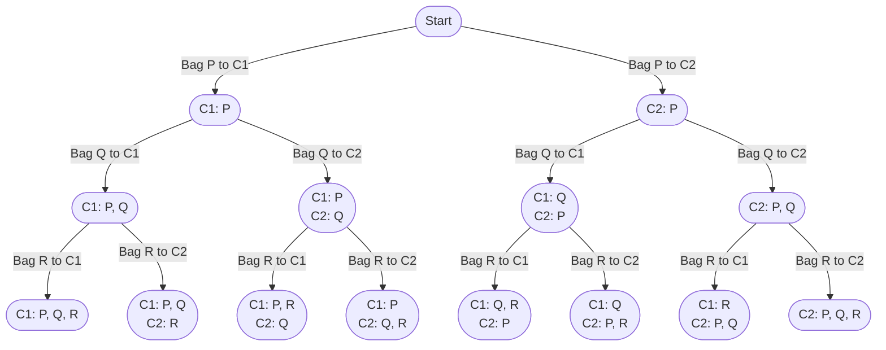

import Tabs from '@theme/Tabs';
import TabItem from '@theme/TabItem';

# 2305. Fair Distribution of Cookies

The problem description can be found at [Leetcode 2305. Fair Distribution of Cookies](https://leetcode.com/problems/fair-distribution-of-cookies/description/).


## Explanation 

This problem can be solved using the Backtracking technique to partition an array into $K$ subarrays. More such questions can be found [here](/backtracking/partition-array-into-k-subarrays).

Let's take the sample input below,

$$
\text{cookies} = [8,15,10], \ \text{k} = 2
$$

Here we also assume bag which takes $8$ cookies is called $P$, bag which takes $15$ cookies is called $Q$ and bag which has $10$ cookies is called $R$.

<div style={{textAlign:"center"}}>


</div>


## Implementation
<Tabs>
  <TabItem value="Java" label="Java" default>

```java
class Solution {
    private int min = Integer.MAX_VALUE;

    public int distributeCookies(int[] cookies, int k) {
        backtrack(cookies, 0, new int[k]);
        return min;
    }

    // Backtracking method to find the minimum of maximum value
    private void backtrack(int[] cookies, int index, int[] dist) {
        // Base case: all cookies are distributed
        if (index == cookies.length) {
            min = Math.min(min, max(dist));
        } else {
            /* 
             * Try distributing the current cookie to each child and find 
             * the minimum value
             */
            for (int i = 0; i < dist.length; i++) {
                /* 
                 * If the distribution already exceeds the previously found min, 
                 * then discard this distribution
                 */
                if (dist[i] + cookies[index] >= min) continue;

                // Distribute cookie to child i
                dist[i] += cookies[index]; 
                backtrack(cookies, index + 1, dist);
                // Backtrack: remove the distributed cookie
                dist[i] -= cookies[index];
            }
        }
    }

    // Method to find the maximum value in a distribution
    private int max(int[] dist) {
        int maxValue = Integer.MIN_VALUE;
        // Find the maximum value in the distribution
        for (int i = 0; i < dist.length; i++) {
            maxValue = Math.max(maxValue, dist[i]);
        }
        return maxValue;
    }
}
```
</TabItem>
</Tabs>


## Complexity

Let's say there are $N$ bags of cookies to distribute among $K$ children.

### Time complexity 

Each of the $N$ bag has $K$ options to choose from.

$$
O(K ^ N)
$$


### Space complexity

Since there are $N$ bags to assign to each child, the stack size for the backtracking will go upto $N$. Additionally, an array of size $K$ is needed to hold the distribution of bags among the $K$ children.

$$
O(N + K)
$$

