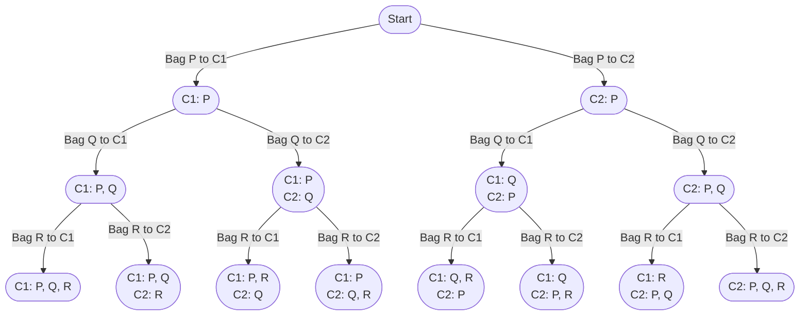

import Tabs from '@theme/Tabs';
import TabItem from '@theme/TabItem';

# 2305. Fair Distribution of Cookies

This page provides solutions for the leetcode problem [Leetcode 2305. Fair Distribution of Cookies](https://leetcode.com/problems/fair-distribution-of-cookies/description/).

## Problem Explanation 

The problem is asking us to divide the cookies among $K$ children in such a way that the maximum number of cookies a single child gets is minimized.

## Solution

For this problem, we need to consider all possible distribution possibilities. Therefore, we use the backtracking technique to partition an array into $K$ subarrays. [More such problem can be found here](/backtracking/partition-array-into-k-subarrays).


Let's take the sample input below,

$$
\text{cookies} = [8,15,10], \ \text{k} = 2
$$

:::info[Assumption]
Assume bag which has $8$ cookies is called $P$, bag which has $15$ cookies is called $Q$ and bag which has $10$ cookies is called $R$.
:::

We start by assigning $P$ bag among $2$ children, which gives us $2$ possibilities. Next we assign $Q$ and $R$ bags in the next iterations, which gives us total of $8$ possibilities.

Below is a graphical representation of the distribution of $3$ cookie bags $P, Q, R$ among $2$ childrens: 

<div style={{textAlign:"center"}}>


</div>

We calculate maximum number of cookies for each distribution. For example, in the distribution $\text{C1}: 8, 15$ and $\text{C2}:10$ maximum number of cookies is for the worker $\text{C1}$ with the value of $23$. 

Finally, we compare maximum number of cookies for each distribution and find minimum among all distributions.


## Implementation
<Tabs>
  <TabItem value="Java" label="Java" default>

```java
class Solution {
    private int min = Integer.MAX_VALUE;

    public int distributeCookies(int[] cookies, int k) {
        backtrack(cookies, 0, new int[k]);
        return min;
    }

    private void backtrack(int[] cookies, int index, int[] dist) {
        if (index == cookies.length) {
            min = Math.min(min, max(dist));
        } else {
            for (int i = 0; i < dist.length; i++) {
                if (dist[i] + cookies[index] >= min) continue;

                dist[i] += cookies[index]; 
                backtrack(cookies, index + 1, dist);
                dist[i] -= cookies[index];
            }
        }
    }

    private int max(int[] dist) {
        int maxValue = Integer.MIN_VALUE;
        for (int i = 0; i < dist.length; i++) {
            maxValue = Math.max(maxValue, dist[i]);
        }
        return maxValue;
    }
}
```
</TabItem>
</Tabs>


## Complexity

Let's say there are $N$ bags of cookies to distribute among $K$ children.

### Time complexity 

Each of the $N$ bag has $K$ options to choose from.

$$
O(K ^ N)
$$


### Space complexity

Since there are $N$ bags to assign to each child, the stack size for the backtracking will go upto $N$. Additionally, an array of size $K$ is needed to hold the distribution of bags among the $K$ children.

$$
O(N + K)
$$

