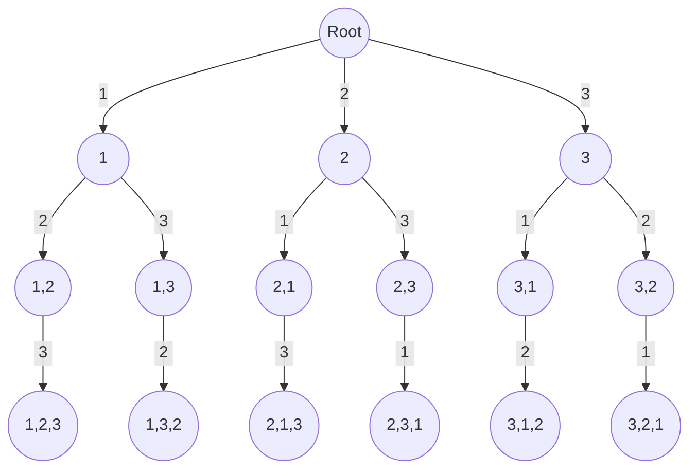

import Tabs from '@theme/Tabs';
import TabItem from '@theme/TabItem';


# Permutations
Permutations, refer to the arrangements of objects where the order matters.

<br />
$$
^nP_r= \frac{n!}{(n−r)!}
$$

<br />


Code execution tree will look like below.

<br />
<div style={{textAlign:"center"}}>



</div>
<br />


### Implementation

Below is a sample implementation of permutations on an array.

<Tabs>
  <TabItem value="Java" label="Java" default>

```java
class Solution {
    private List<List<Integer>> res;
    public List<List<Integer>> permuteUnique(int[] nums) {
        res = new ArrayList<>();
        Arrays.sort(nums);
        solve(nums, 0, new boolean[nums.length], new ArrayList<>());
        return res;
    }

    private void solve(int[] nums, int index, boolean[] visited, List<Integer> list) {
        if(list.size() == nums.length) {
            res.add(new ArrayList<>(list));
        }
        else {
            for(int i = 0; i < nums.length; i++) {
                if(visited[i]) continue;

                if(i > 0 && nums[i] == nums[i - 1] && !visited[i - 1]) continue;

                visited[i] = true;
                list.add(nums[i]);
                solve(nums, i + 1, visited, list);
                list.remove(list.size() - 1);
                visited[i] = false;
            }
        }
    }
}
```
</TabItem>
</Tabs>

### Complexity

Let's say there $N$ elements in an array

#### Time Complexity
$
O(N!)
$

#### Space Complexity
$
O(N)
$
<br />